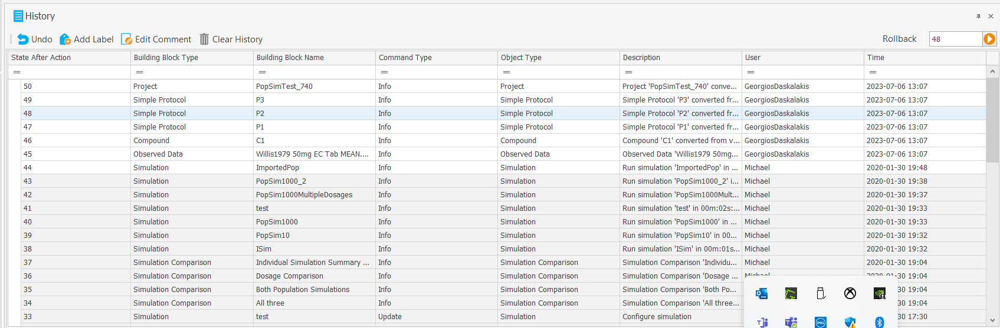
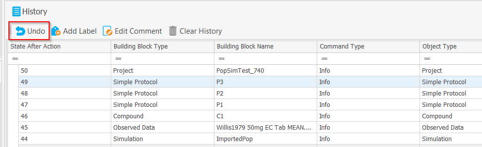

# Commands

## Introduction

In this part of the documentation we will present the `Command` classes that are used to changed the values of the domain objects and its usages.

## General

When changing the values of domain objects in OSPSuite, instead of writing the values directly we are using Commands that change these objects. We do this for a few reasons. Firstly because we want to use the Commands to keep a history of changes that has happened to our data. This history also serves a regulatory purpose. 



Additionally those commands give us the possibility to reverse the actions that have happened. The user can do this by selecting the command from the history and clicking undo.



## Structure of the class and writing a new command

When you want to create a new action that changes the data, you will need to write a new command.

# Command Execution

The execution of a command is defined in the ExecuteWith(...) function override:

```
protected override void ExecuteWith(IOSPSuiteExecutionContext context)
```

Note: If the command is defined in PK-Sim or MoBi, the context would be the context interface more specific to the project, e.g. in PK-Sim 

```
IExecutionContext : IOSPSuiteExecutionContext<PKSimProject> 
```

In the body of this override we define the execution steps of the command. The context serves two purposes: 

    The first is to give the command the possibility to resolve objects it might need from it, instead of having everything needed explicitly passed to it. For example, in the case of adding a new object to the project, the command will need a reference to the project. This reference gets resolved from the context. The execution of the command might even be dependant on a task or a service that can be resolved from the project. Additionally we can use the context to publish events when a change has happened that requires a global notification event. We can see this e.g. in the [command used to change Observed Data MetaData](https://github.com/Open-Systems-Pharmacology/OSPSuite.Core/blob/develop/src/OSPSuite.Core/Commands/ChangeObservedDataMetaDataCommand.cs) in Core, where after changing the MetaData a new event notifying about that change has to be published:

    ```
    context.PublishEvent(new ObservedDataMetaDataChangedEvent(_observedData));
    ```

    Secondly we use the context to store data that we will need to reverse the command, even for data that we initially receive in the command explicitly. After the command is executed, the steps defined in the `ClearReferences()` are executed to clear the memory. Then with the `RestoreExecutionData(IExecutionContext context)` override we can restore the data from the context. An example here would be the [SetTransportTypeCommand](https://github.com/Open-Systems-Pharmacology/PK-Sim/blob/develop/src/PKSim.Core/Commands/SetTransportTypeCommand.cs) in PK-Sim, where we get the `IndividualTransporter` as an argument in the constructor of the Command class:

    ```
    public SetTransportTypeCommand(IndividualTransporter individualTransporter, TransportType transportType, IExecutionContext context)
      {
         .
         _individualTransporter = individualTransporter;
         .
         .
         .
         _transporterId = _individualTransporter.Id;
         
      }
    ```
    
    the `_individualTransporter` object reference is then cleared in `ClearReferences()` 
    
    ```
    protected override void ClearReferences()
    {
        _individualTransporter = null;
        .
        .
    }
    ```
     
    and then restore it through the context in `RestoreExecutionData(..)` by just using its Id. `RestoreExecutionData(..)` is called before the inverse command. 

    ```
    public override void RestoreExecutionData(IExecutionContext context)
    {
        .
        .
        _individualTransporter = context.Get<IndividualTransporter>(_transporterId);
    }
    ```
    In other cases we might need to explicitly register an object to the context in the `ExecuteWith(...)` function.

# Inverse Command

In order to be able to reverse the execution of a command we need inverse commands. Which command we use for this is specified in the `GetInverseCommand(IOSPSuiteExecutionContext context)` function override part of a command. There are cases when we do not really need a new command to reverse the actions, e.g. when we have changed a value, we simply need to use the same command with different parameters to reset the values. We can find an example for that in the [ChangeObservedDataMetaDataCommand](https://github.com/Open-Systems-Pharmacology/OSPSuite.Core/blob/develop/src/OSPSuite.Core/Commands/ChangeObservedDataMetaDataCommand.cs). Usually though a separate new command will have to be written to reverse the actions of the original command. For example if we have added observed data to the project, in reversing the command we need to remove exactly that observed data. [AddObservedDataToProjectCommand](https://github.com/Open-Systems-Pharmacology/OSPSuite.Core/blob/develop/src/OSPSuite.Core/Commands/AddObservedDataToProjectCommand.cs) has [RemoveObservedDataFromProjectCommand](https://github.com/Open-Systems-Pharmacology/OSPSuite.Core/blob/develop/src/OSPSuite.Core/Commands/RemoveObservedDataFromProjectCommand.cs) as its inverse - and vice versa of course.

# Further properties

The [ICommand interface](https://github.com/Open-Systems-Pharmacology/OSPSuite.Core/blob/develop/src/OSPSuite.Core/Commands/Core/Command.cs) defines further properties, like the Description and ObjectType (type of object on which the command has been executed) that will also end up in the history view.

## MacroCommands

Macro Commands are a collection of separate commands. They keep the list of subcommands to which commands can be added, and the execution of a MacroCommand is the execution of each subcommand individually. Hence they do not have additional data of their own (ObjectType, Comment etc.). Clearing, restoring the execution data or getting the inverse of macro commands is the simply performing the corresponding action for each one of the subcommands.

## EmptyCommands

EmptyCommand is an implementation of the [Null Object Pattern](https://en.wikipedia.org/wiki/Null_object_pattern). We are using it as a return object in the cases when 
we do not want something to happen, instead of returning null and having then to check for null all the time down the execution path. 

## Name similarity with UICommands

In the OSPSuite there also exist the interface IUICommand that is NOT the same as ICommand. The UICommands actually refer to specific UI actions (buttons, context menus etc) and either get executed directly or using tasks and without being reversible or being written in history. Otherwise they also need to invoke a separate command that takes care of executing the actions on the data.
