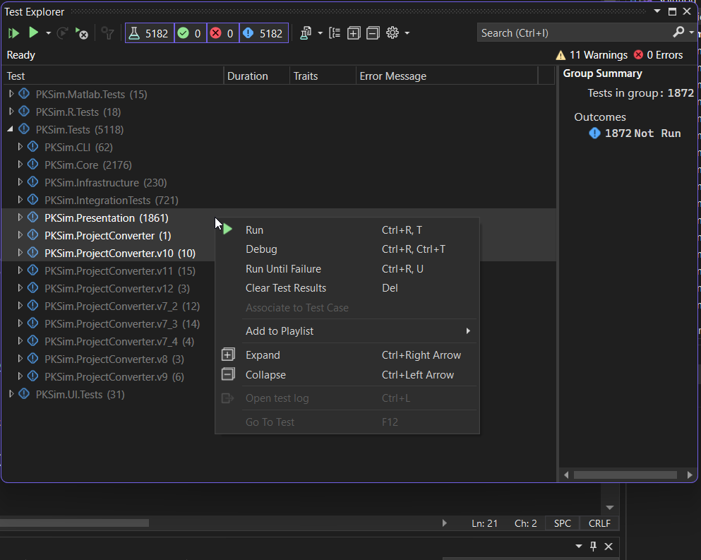
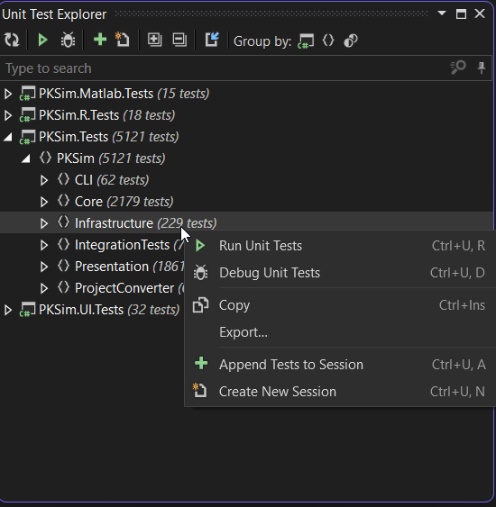
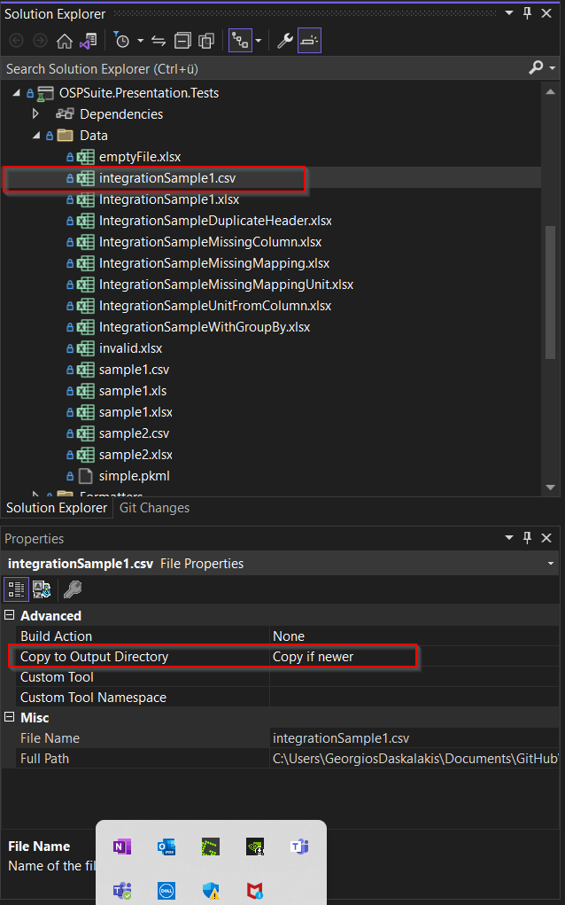

# Unit and Integration Testing

## Introduction

In this part of the documentation we will present the structure of existing unit tests, as well as the abstract classes, helpers, contexts and other resources that have already been created to facilitate the creation and running of unit tests.

# General

Unit testing is an integral part of our software practices and we keep the code that we write well covered by tests. Currently Pull Requests are only being accepted if they contain at least one unit test ( with the logical exceptions e.g. a PR containing only package updates ) and the code can be considered well covered by unit tests. We try when possible to implement a Test-Driven-Development (TDD) approach, and specifically for fixing bugs it is strongly suggested to first write a failing test according to the error description and then fix the issue, to ensure the correct and permanent elimination of the bug.

For the C# solutions to write unit tests we are using [NUnit](https://nunit.org/) in combination with [FakeItEasy](https://fakeiteasy.github.io/) to mock objects and intercept calls and our own [BDDHelper](https://github.com/Open-Systems-Pharmacology/OSPSuite.BDDHelper) comprising of extension methods to write and structure unit tests in a Behavior-Driven Development manner.


# Test Outline

## The abstract class

We usually create one test class file for every class we want to test. Let's take for example a newly created class, let's call it NewClass: `public class NewClass`. When writing the unit tests for it, we would start with an abstract class which will be the parent to all the specific test case classes:

```
public abstract class concern_for_NewClass : ContextSpecification<NewClass>
{
    protected override void Context()
    {}
}
```
Please follow this naming convention for the abstract unit test classes of calling them  `concern_for_NewClass` where `NewClass` the class to be tested.

Usually in this abstract class we would define the `Context() override` and also some protected members that would be common to all the test cases (even if their value would not stay constant for every test case). 

The `Context()` is the setup of the test, where the environment and necessary objects are created. Functionalities that will be used overall in the test class should be defined and created here. As part of this `Context()` we could assign the `sut` (System Under Test) - alternatively this could be part of the `Because()` that we will see in the next segment, specifically if our test case concerns the instantiation of the object. 

Apart from this `Context()` that would then be called (and if necessary also overridden) for every test case which inherits from this abstract class, we can also create a GlobalContext() override, where we instantiate resource-heavy objects that are used overall in the test class, since objects in the GlobalContext() are only instantiated once per test class.


## The individual test cases

Continuing with our example, we write an individual unit test class for `NewClass`:

```
public class When_changing_a_NewClass_property_value : concern_for_NewClass
{
    protected override void Context()
    {
        base.Context();
        .
        .
        .
    }

    protected override void Because()
    {
        ...
    }

    [Observation]
    public void should_have_updated_the_value_correctly()
    {
        ...
    }

    [Observation]
    public void should_notify_about_the_change()
    {
        ...
    }
}
```

Please note the convention of naming the unit test classes using complete sentences in lowercase separated with underscores instead of whitespaces. The BDDHelper then replaces the underscores with whitespaces for the test reports. The same naming logic applies to the Observations. Unit test classes usually ( but of course not necessarily ) start with "When_.." and Observations with "should_...". It is important that both the unit test class name as well as the observation fully and correctly describe the behaviour that gets tested and the expected outcome. The length of the name is in this case of no big concern.

### Because() and Observations

Instead of packing both the behaviour that leads to a result that we want to test and the assertion of the correct outcome in one code segment, we prefer to separate those two in a `Because()` function where we have the behaviour that will be tested and an `Observation` that tests the outcome.


# Creation of Objects and Mocking 

It is suggested to avoid mocking as far as possible. In our experience this can lead to a situation where too much mocking results in a green test where the actual functionality is not correct and also to more difficulty in maintenance. Instead, it is generally suggested to create real objects where possible and ideally to use helper functions for this task, in order to make the creation of the real objects reusable and avoid code duplication.

Before writing your own function for the creation of an object necessary for testing, please note that in the [HelpersForSpecs](https://github.com/Open-Systems-Pharmacology/OSPSuite.Core/tree/develop/tests/OSPSuite.HelpersForTests) folder you can find functions for the creations of many frequently used objects, like e.g. individuals or simulations. When writing a function to create an object that could be needed overall in the tests, it is these classes exactly that should be extended. Especially helpful are the DomainHelperForSpecs (in all the solutions: Core, PK-Sim and MoBi) where you can find functionalities to create domain objects (you can get e.g. the path to test files, create a new test simulation, create a new test individual, test observed data etc.).

## FakeItEasy

As discussed, to mock objects we use FakeItEasy. On the documentation of the [package](https://fakeiteasy.github.io/) you can find a quite detailed documentation of its usage. Still we will present here some of the functionalities that we use more often:

You can create a fake object of type `MyClass` or `IMyInterface` very simply:

```
var _fake = A.Fake<MyClass>();
```

It is easily possible to intercept calls to fake objects to return specific objects:

```
var _input = new InputValue();
var _value = new MyValue();
A.CallTo(() => _fake.GetValueForInput(_input)).Returns(_value);
```

making the mocked object return `_value` when `GetValueForInput()` is called with `_input` as parameter. Alternatively you can return the same value regardless of the input parameter using `A<Type>.Ignored` like this:

```
A.CallTo(() => _fake.GetValueForInput(A<InputValue>.Ignored)).Returns(_value);
```

Finally we often use the fakes to ensure a call to them has happened or not in our Observation segment, e.g. : 

```
A.CallTo(() => _fake.GetValueForInput(A<InputValue>.Ignored)).MustHaveHappened();
```
or

```
A.CallTo(() => _fake.GetValueForInput(A<InputValue>.Ignored)).MustNotHaveHappened();
```


# BDDHelper

As discussed in the introduction, we use also use the extensions from [BDDHelper](https://github.com/Open-Systems-Pharmacology/OSPSuite.BDDHelper) in our tests. It is strongly recommended to use the hereby available functionalities instead of simple NUnit Asserts, for consistency, but also because some things are centrally implemented in these functions, like comparison tolerance for values for example.  

So please write:

```
[Observation]
public void values_should_set_correctly()
{
    _myObject.DataValue.ShouldBeEqualTo(3);
}
```
instead of:

```
[Observation]
public void values_should_set_correctly()
{
    Assert.AreEqual(_myObject.DataValue, 3);
}
```


# Integration Tests

We use integration tests to test functionality that requires the loading of resource-heavy real objects and are generally oriented towards scenarios that run longer, open whole projects, load the whole context etc. There is also a difference in how we handle integration tests compared to normal unit tests in our Continuous Integration pipeline. Unit tests are run on every build, but integration tests are only run on the nightly builds since they are regarded as more time- and resource- consuming.

Specifically for integration tests we extend the usual `ContextSpecification<T>` of normal unit tests in `ContextForIntegration<T> : ContextSpecification<T>`. There we create and mock a few more things to begin with, the main one being an IoC container that we also fill with registrations.  

## DataBaseUpdateSpecs

In PK-Sim we have a specific kind of integration tests that make sure that the database gets correctly updated and stays consistent with code and version changes.


# Constants for Tests

In order not to fill up the constant definitions that are used for the actual application, constants used only for tests should be defined in the dedicated classes [ConstantsForSpecs](https://github.com/Open-Systems-Pharmacology/OSPSuite.Core/blob/develop/tests/OSPSuite.HelpersForTests/ConstantsForSpecs.cs) in OSPSuite.Core or [CoreConstantsForSpecs](https://github.com/Open-Systems-Pharmacology/PK-Sim/blob/develop/tests/PKSim.Tests/CoreConstantsForSpecs.cs) in PK-Sim.


# TestCaseSource()

You can use [TestCaseSource()](https://docs.nunit.org/articles/nunit/writing-tests/attributes/testcasesource.html) to avoid code duplication and create parameterized tests. Examples of unit tests that take advantage of this functionality can be found in the [OSPSuite.FuncParser repository](https://github.com/Open-Systems-Pharmacology/OSPSuite.FuncParser), for example in the [DimensionParserSpecs](https://github.com/Open-Systems-Pharmacology/OSPSuite.FuncParser/blob/master/tests/OSPSuite.FuncParser.Tests/DimensionParserSpecs.cs).


# Unit Test Explorer

A helpful tip is to use the Unit Test Explorer of Visual Studio:



or of Resharper:



To run or debug a single unit test, or all the selected or even all the unit tests in a solution. Specifically for Resharper, you can refer to its [documentation about starting, debugging and analysing tests](https://www.jetbrains.com/help/resharper/Executing_Analyzing_Tests.html) .


# Test Files

Sometimes test files are necessary for the unit tests, such as .xlsx files as input for example. These files should be saved in the "Data" folder of the respective project, e.g. in [https://github.com/Open-Systems-Pharmacology/OSPSuite.Core/tree/develop/tests/OSPSuite.Presentation.Tests/Data](https://github.com/Open-Systems-Pharmacology/OSPSuite.Core/tree/develop/tests/OSPSuite.Presentation.Tests/Data) for `OSPSuite.Presentation.Tests.csproj`. When adding a new test file make sure you set its `Copy to Output Directory` property in Visual Studio to `Copy if newer`, otherwise the file will not be found when running the test.



Additionally, in the PK-Sim `DomainHelperForSpecs` you can find functionalities to easily get the full path just from the name. For example, if you have a "TestData.csv" file you can get the full path like this:

```
var fullPath = DomainHelperForSpecs.DataFilePathFor("TestData.csv");
```