# Introduction
PK-Sim uses an [SQLite](https://www.sqlite.org/index.html) database to store data models and templates. In this part of the developer documentation we will present this database with a thorough description of its structure and tables.

More specifically, in the PK-Sim DB, we store:

* Structural models for PBPK modeling of small and large molecules:
* Anatomical and physiological parameters in different animal species and human populations for **healthy** individuals
  * For details regarding parameterization of **diseased** individuals please refer to [tab_population_disease_states](#tab_population_disease_states).
* Templates for small and large molecules.
* Templates for optional processes like
  * Metabolizing pathways
  * Different active transporter types (influx, efflux, bidirectional)
  * Protein binding partners
* Templates for various administration routes and formulations
* Prediction models for 
  * Tissue partition coefficients
  * Cellular permeabilities
  * Intestinal permeability
* Templates for events (meals etc.)

The database can be found in the [PK-Sim repository under **src/Db/PKSimDB.sqlite**](https://github.com/Open-Systems-Pharmacology/PK-Sim/blob/develop/src/Db/PKSimDB.sqlite).

## DB Schema Diagrams

For this documentation segment, database schema diagrams were created using the [SchemaCrawler](https://www.schemacrawler.com/). You can find a short description of how to install and use the _SchemaCrawler_ for creating schema diagrams [here]( https://github.com/Open-Systems-Pharmacology/developer-docs/wiki/Using-SchemaCrawler-for-creating-of-database-schema-diagrams ).

# General remarks
When a database value describes a numeric property of a quantity (e.g., parameter value, allowed value range, etc.), the value is always stored in the **base unit of the dimension of the quantity**. 

Check the [OSP Dimensions Repository](https://github.com/Open-Systems-Pharmacology/OSPSuite.Dimensions/blob/master/OSPSuite.Dimensions.xml) to see what the base unit of a dimension is!

Some of the common properties used in many tables:

* **display_name** The name of the entity to be used in the UI in PK-Sim.

  NOTE: MoBi does not support the "display name" concept, so all entities are displayed with their internal name. Also within a model all objects are stored with their internal name. It is therefore advisable to keep the display name the same as the internal name. Exceptions are e.g. special characters like "*", "|" etc. which cannot be used in internal names. 

* **description** Longer description of the entity, which is displayed as a tooltip in PK-Sim and can be edited in MoBi.

* **sequence** Used to sort objects in the UI (unless another sorting algorithm applies, e.g. alphabetical).

* **icon_name** Defines which icon is used for the entity. 

  If not empty: the icon with the given name must be present in the `OSPSuite.Assets.Images`

* {**min_value**, **min_isallowed**, **max_value**, **max_isallowed**} specifies the allowed range of values for a numeric quantity. 
  * **min_isallowed** and **max_isallowed** define whether the corresponding bounded value range is open or closed.
  * **min_value** can be empty. In this case the lower bound is `-Infinity`. The value of **min_isallowed** will then be ignored.
  * **max_value** can be empty. In this case the upper bound is `+Infinity`. The value of **max_isallowed** will then be ignored.

Boolean values are always represented as **integers restricted to {0, 1}**.

:grey_exclamation: Before renaming or removing basic entities (parameters, containers, observers): you should always **check if the modified entity is explicitly used by its name in PK-Sim or in the OSPSuite.Core**. If so, further code changes are required to reflect the database change! In some cases, the database objects that appear to be unused (when looking only at the database) are actually used in PK-Sim to create objects on the fly. 

# Overview diagrams

Each of the following subsections focuses on one aspect and shows only a **subset** of the database tables relevant to that topic. The last subsection shows the complete schema with all tables.

## Containers
A *container* is a model entity that can have children. 
In the context of PK-Sim, everything except parameters and observers is a container.

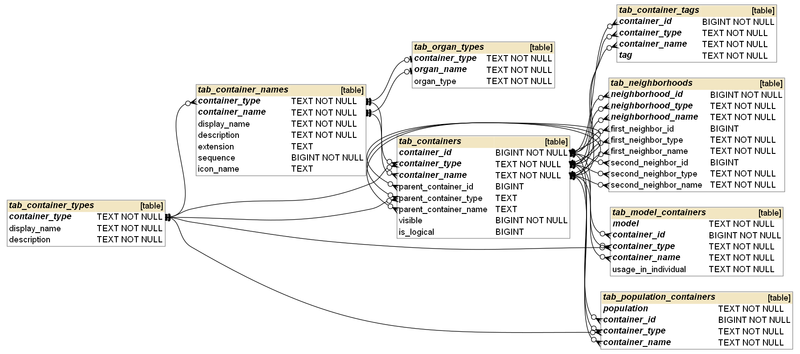

### tab_container_names
Describes an abstract container (e.g. "Plasma"), which can be inserted at various places in the container structure defined in *[tab_containers](#tab_containers)*.

* **container_type** is used, for example, to map a container to the correct container class in PK-Sim.
* **extension** is not used by PK-Sim and is only useful for some database update scripts.
* **icon_name** defines which icon is used for a container. 

There are some "special" containers defined in *tab_container_names* that are not used in the container hierarchy defined in *[tab_containers](#tab_containers)*. These containers are only used for **referential integrity when defining some relative object paths** (see the [Formulas](#formulas) section for more details).

### tab_container_types
Defines available container types.

### tab_organ_types
Classifies containers of type `ORGAN`. This classification is used in PK-Sim to group organs in different views (e.g. *Tissue Organs* vs. *Vascular System* vs. *GI Tract* etc.).

* **container_type** is always set to "ORGAN".
* **organ_name** is the name of the organ.
* **organ_type** can be one of the values defined in [enum OrganType](https://github.com/Open-Systems-Pharmacology/PK-Sim/blob/develop/src/PKSim.Core/Model/OrganType.cs).

### tab_containers
Defines the container hierarchy and includes **all possible containers** which can appear in a model. When a model is created, some containers are filtered out based on the information in *[tab_model_containers](#tab_model_containers)* and *[tab_population_containers](#tab_population_containers)* (s. below)

* Each container within a hierarchy is identified by the combination 
  `{container_id, container_type, container_name}`. 

  * `container_id` is unique across all containers. In principle, it would be sufficient to use only the *container id* as the primary key. Container type and container name have been included in the primary key for convenience (e.g. when querying data from other tables, it is not always necessary to include *tab_containers* and *tab_container_names* etc.). 

* Each container can have a parent container defined by the combination
  `{parent_container_id, parent_container_type, parent_container_name}`. 

  * Containers that appear at the top level of the *Spatial Structure* are defined as children of the special `ROOT` container. The `ROOT` container itself has no parent.

    | container_id | container_type | container_name     | parent_container_id | parent_container_type | parent_container_name |
    | ------------ | -------------- | ------------------ | ------------------- | --------------------- | --------------------- |
    | 146          | ORGANISM       | Organism           | 145                 | SIMULATION            | ROOT                  |
    | 777          | GENERAL        | Neighborhoods      | 145                 | SIMULATION            | ROOT                  |
    | 1026         | GENERAL        | MoleculeProperties | 145                 | SIMULATION            | ROOT                  |
    | 4205         | GENERAL        | Events             | 145                 | SIMULATION            | ROOT                  |

  * Top containers of other building blocks (Passive Transports, Reactions, Events, Formulations, ...) are all defined as containers without a parent. 

* **tab_containers.visible** defines if a container is shown in PK-Sim in hierarchy view (TODO rename column to **is_visible**).

* **tab_containers.is_logical** defines if a container is *physical* or *logical* (s. the [OSP documentation](https://docs.open-systems-pharmacology.org/working-with-mobi/mobi-documentation/model-building-components#spatial-structures) for details).

### tab_container_tags
Describes which additional tags are added to a container.

* the **name** of a container is always added as a tag programmatically and does not need to be added here.

### tab_neighborhoods
Defines 2 neighbor containers for each neighborhood of a spatial structure

* There are no rules or restrictions as to which of 2 adjacent containers must be defined as the first and which as the second container. For example, passive transports are defined by the container criteria of their source and target containers, and changing the first and second neighbour containers does not affect the later creation of the transport. Care should only be taken when using the keywords FIRST_NEIGHBOR and SECOND_NEIGHBOR in the formulas. 
  * Even in the latter case, swapping neighbors may not be critical. E.g. if both neighbor containers have **the same parent container** and the formula uses the path `FIRST_NEIGHBOR|..|Parameter1`, then swapping the formula path with `SECOND_NEIGHBOR|..|Parameter1`would result in the same formula, because F`IRST_NEIGHBOR|..` and `SECOND_NEIGHBOR|..` both point to the same container, making the formula invariant with respect to neighbor switching. 
  * But if the formula refers e.g. to `FIRST_NEIGHBOR|Parameter1` - then the neighbor order is relevant.

### tab_population_containers
Defines which containers are created in individual/population building blocks in PK-Sim. For each population, this is a subset of the containers defined in *[tab_containers](#tab_containers)*.

### tab_model_containers
Defines which containers **can** be included into the final model. Whether a container is included into the model is estimated based on the value of the column **usage_in_individual** as following:

* if `usage_in_individual = REQUIRED`
  * if the container is available in the individual/population building block used for the model creation: container is added to the model
  * otherwise: error, model cannot be created
* if `usage_in_individual = OPTIONAL`
  * if the container is available in the individual/population building block used for the model creation: container is added to the model
  * otherwise: container is NOT added to the model
* if `usage_in_individual = EXTENDED`
  * container is added to the model in any case
  * containers of this type usually should not be defined in *[tab_population_containers](#tab_population_containers)* <!--(TODO [s. the discussion](https://github.com/Yuri05/DB_Questions/discussions/1))-->

## Processes
*Processes* are defined as containers with `container_type="PROCESS"` and must be inserted into *[tab_container_names](#tab_container_names)* first; once done they can be inserted into *[tab_processes](#tab_processes)* and further process-specific tables.

### tab_processes
Contains the following information about a process:

* **template** defines whether a process is always added to the selected model or only on demand.

  * For example, all passive transports or FcRn binding reactions in a protein model have `template = 0`

  * For example, active transports or metabolization reactions which are added only if the corresponding process was configured in a simulation in PK-Sim have `template = 1`

* **group_name** is used to identify where (in which building blocks or simulations) the processes are used in PK-Sim.

  * Processes with the **parent** group *COMPOUND_PROCESSES* are templates for active processes (active transport, specific binding, elimination, metabolization, inhibition, induction, ...) used in the compound building block of PK-Sim.
  * Processes with the group *APPLICATION* are application transports.
  * Processes with the group *INDIVIDUAL_ACTIVE_PROCESS* are templates for *active transports*, used in an *Expression Profile* building block. These templates have no parameters and are further specified in *[tab_transports](#tab_transports)* (s. below).
  * Processes with the group *PROTEIN* describe *production* and *degradation* of proteins (enzymes, transporters, binding partners).
  * Processes with the group *SIMULATION_ACTIVE_PROCESS* describe the processes which are created in a simulation from both compound process template and individual (expression profile) process template.
  * Processes with the group *UNDEFINED* are processes where the group is not relevant (typically all *passive* processes).

    | GROUP_NAME                    | PARENT_GROUP       |
    | ----------------------------- | ------------------ |
    | ACTIVE_TRANSPORT              | COMPOUND_PROCESSES |
    | ACTIVE_TRANSPORT_INTRINSIC    | COMPOUND_PROCESSES |
    | APPLICATION                   |                    |
    | ENZYMATIC_STABILITY           | COMPOUND_PROCESSES |
    | ENZYMATIC_STABILITY_INTRINSIC | COMPOUND_PROCESSES |
    | INDIVIDUAL_ACTIVE_PROCESS     |                    |
    | INDUCTION_PROCESSES           | COMPOUND_PROCESSES |
    | INHIBITION_PROCESSES          | COMPOUND_PROCESSES |
    | PROTEIN                       |                    |
    | SIMULATION_ACTIVE_PROCESS     |                    |
    | SPECIFIC_BINDING              | COMPOUND_PROCESSES |
    | SYSTEMIC_PROCESSES            | COMPOUND_PROCESSES |
    | UNDEFINED                     |                    |

* **kinetic_type** is used for the mapping
  `{Compound process template, Individual process template} ▶️ Simulation process`
  
  Example: active transports
  * for the active transports there are currently 2 compound templates:

    | process                      | group_name       | kinetic_type |
    | ---------------------------- | ---------------- | ------------ |
    | ActiveTransportSpecific_Hill | ACTIVE_TRANSPORT | Hill         |
    | ActiveTransportSpecific_MM   | ACTIVE_TRANSPORT | MM           |

  * there are different individual active transport templates - specified by their source and target (Interstitial<=>Intracellular, Interstitial<=>Plasma, Blood Cells <=> Plasma etc.)
  (kinetic type is not specified on the individual building block level and thus is set to "*Undefined*")

    | process                                              | group_name                | kinetic_type |
    | :--------------------------------------------------- | ------------------------- | ------------ |
    | ActiveEffluxSpecificIntracellularToInterstitial | INDIVIDUAL_ACTIVE_PROCESS | Undefined    |
    | ActiveInfluxSpecificInterstitialToIntracellular | INDIVIDUAL_ACTIVE_PROCESS | Undefined    |
    | ActiveEffluxSpecificInterstitialToPlasma        | INDIVIDUAL_ACTIVE_PROCESS | Undefined    |
    | ActiveInfluxSpecificPlasmaToInterstitial        | INDIVIDUAL_ACTIVE_PROCESS | Undefined    |
    |  ...       | ...                       | ...          |

  * In the simulation
    * `ActiveTransportSpecific_MM (Compound) +   
    ActiveEffluxSpecificIntracellularToInterstitial (Individual) ▶️ 
    ActiveEffluxSpecificIntracellularToInterstitial_MM (Simulation)`

    * `ActiveTransportSpecific_Hill (Compound) + 
    ActiveEffluxSpecificIntracellularToInterstitial (Individual) ▶️ 
    ActiveEffluxSpecificIntracellularToInterstitial_Hill (Simulation)`

    | process                                              | group_name                | kinetic_type |
    | :--------------------------------------------------- | ------------------------- | ------------ |
    | ActiveEffluxSpecificIntracellularToInterstitial_Hill | SIMULATION_ACTIVE_PROCESS | Hill         |
    | ActiveEffluxSpecificIntracellularToInterstitial_MM   | SIMULATION_ACTIVE_PROCESS | MM           |
    | ActiveInfluxSpecificInterstitialToIntracellular_Hill | SIMULATION_ACTIVE_PROCESS | Hill         |
    | ActiveInfluxSpecificInterstitialToIntracellular_MM   | SIMULATION_ACTIVE_PROCESS | MM           |
    | ActiveEffluxSpecificInterstitialToPlasma_Hill        | SIMULATION_ACTIVE_PROCESS | Hill         |
    | ActiveEffluxSpecificInterstitialToPlasma_MM          | SIMULATION_ACTIVE_PROCESS | MM           |
    | ActiveInfluxSpecificPlasmaToInterstitial_Hill        | SIMULATION_ACTIVE_PROCESS | Hill         |
    | ActiveInfluxSpecificPlasmaToInterstitial_MM          | SIMULATION_ACTIVE_PROCESS | MM           |
    | ...                                                  | ...                       | ...          |

* **process_type** is used for more detailed process specification within a group and is used for various purposes in PK-Sim (s. e.g. [FlatProcessToCompoundProcessMapper](https://github.com/Open-Systems-Pharmacology/PK-Sim/blob/develop/src/PKSim.Infrastructure/ORM/Mappers/FlatProcessToCompoundProcessMapper.cs), [FlatProcessToActiveProcessMapper](https://github.com/Open-Systems-Pharmacology/PK-Sim/blob/develop/src/PKSim.Infrastructure/ORM/Mappers/FlatProcessToActiveProcessMapper.cs),etc.)

  | group_name                    | process_type             |
  | ----------------------------- | ------------------------ |
  | ACTIVE_TRANSPORT              | ActiveTransport          |
  | ACTIVE_TRANSPORT_INTRINSIC    | ActiveTransport          |
  | APPLICATION                   | Application              |
  | ENZYMATIC_STABILITY           | Metabolization           |
  | ENZYMATIC_STABILITY_INTRINSIC | Metabolization           |
  | INDIVIDUAL_ACTIVE_PROCESS     | BiDirectional            |
  | INDIVIDUAL_ACTIVE_PROCESS     | Efflux                   |
  | INDIVIDUAL_ACTIVE_PROCESS     | Influx                   |
  | INDIVIDUAL_ACTIVE_PROCESS     | PgpLike                  |
  | INDUCTION_PROCESSES           | Induction                |
  | INHIBITION_PROCESSES          | CompetitiveInhibition    |
  | INHIBITION_PROCESSES          | IrreversibleInhibition   |
  | INHIBITION_PROCESSES          | MixedInhibition          |
  | INHIBITION_PROCESSES          | NoncompetitiveInhibition |
  | INHIBITION_PROCESSES          | UncompetitiveInhibition  |
  | PROTEIN                       | Creation                 |
  | SIMULATION_ACTIVE_PROCESS     | BiDirectional            |
  | SIMULATION_ACTIVE_PROCESS     | Efflux                   |
  | SIMULATION_ACTIVE_PROCESS     | Induction                |
  | SIMULATION_ACTIVE_PROCESS     | Influx                   |
  | SIMULATION_ACTIVE_PROCESS     | IrreversibleInhibition   |
  | SIMULATION_ACTIVE_PROCESS     | PgpLike                  |
  | SPECIFIC_BINDING              | SpecificBinding          |
  | SYSTEMIC_PROCESSES            | Elimination              |
  | SYSTEMIC_PROCESSES            | EliminationGFR           |
  | SYSTEMIC_PROCESSES            | Metabolization           |
  | SYSTEMIC_PROCESSES            | Secretion                |
  | UNDEFINED                     | Passive                  |

* **action_type** is one of {`APPLICATION`, `INTERACTION`, `REACTION`, `TRANSPORT`}  (s. [enum ProcessActionType](https://github.com/Open-Systems-Pharmacology/PK-Sim/blob/develop/src/PKSim.Infrastructure/ORM/FlatObjects/ProcessActionType.cs)).

* **create_process_rate_parameter** defines if the `Process Rate` parameter should be created for transport or reaction (s. [OSP Suite documentation](https://docs.open-systems-pharmacology.org/working-with-mobi/mobi-documentation/model-building-components#reactions-and-molecules) for details.)

### tab_process_types
Defines available process types.

### tab_kinetic_types
Defines available process kinetic types.

### tab_process_descriptor_conditions
Describes source and target container criteria for transports and source container criteria for reactions

* **tag_type** can be one of `{SOURCE, TARGET}`

### tab_process_molecules
Describes the reactions which are **always** part of a model (like e.g. *FcRn binding* in the large molecules model)
(TODO rename the table, s. the issue https://github.com/Open-Systems-Pharmacology/PK-Sim/issues/2309)

* **direction** can be of `IN` (educt), `OUT` (product) or `MODIFIER`

### tab_process_rates
Describes the rate (kinetic) of a process

* Template processes with the **parent** group **COMPOUND_PROCESSES** and processes with the group **INDIVIDUAL_ACTIVE_PROCESS** always have `Zero_Rate` formula, because they are used in the corresponding building blocks where the process rate does not matter. The real rate is then set for the corresponding **simulation** process, e.g. 

  | process                                            | calculation_method | formula_rate                                   |
  | -------------------------------------------------- | ------------------ | ---------------------------------------------- |
  | ActiveTransportSpecific_MM                         | LinksCommon        | Zero_Rate                                      |
  | ActiveEffluxSpecificIntracellularToInterstitial    | LinksCommon        | Zero_Rate                                      |
  | ActiveEffluxSpecificIntracellularToInterstitial_MM | LinksCommon        | ActiveEffluxSpecificWithTransporterInTarget_MM |

### tab_model_transport_molecule_names
Restricts which molecules are transported by a passive transport for particular model. As per default, passive transport will transfer all floating molecules from its source container to the target container. In this table, some molecules can be excluded (`should_transport=0`) or transport can be restricted only to the specific molecules (`should_transport=1`). S. the [Passive Transports documentation](https://docs.open-systems-pharmacology.org/working-with-mobi/mobi-documentation/model-building-components#passive-transports)
(TODO rename the table, s. the issue https://github.com/Open-Systems-Pharmacology/PK-Sim/issues/2309)

### tab_transports
Defines which active transports can be created in the model.
(TODO rename the table, s. the issue https://github.com/Open-Systems-Pharmacology/PK-Sim/issues/2309)
<!--(TODO [s. the discussion](https://github.com/Yuri05/DB_Questions/discussions/5))-->

### tab_transport_directions
Defines all available transport directions
(TODO rename the table, s. the issue https://github.com/Open-Systems-Pharmacology/PK-Sim/issues/2309)

### tab_known_transporters
Defines a *global* transporter direction for a `{Species, Gene}` combination.
When adding a transporter in PK-Sim that is not available in this data table: the transporter direction is set to default and the user is informed that the transporter was not found in the database.
See [Localizations, directions, and initial concentrations of transport proteins](https://docs.open-systems-pharmacology.org/working-with-pk-sim/pk-sim-documentation/pk-sim-expression-profile#localizations-directions-and-initial-concentrations-of-transport-proteins) in the OSP Suite documentation.

### tab_known_transporters_containers
The *global* transporter direction defines the default transporter direction and polarity in each organ. However, some organs may have different transporter properties. To account for this, the *local* transporter direction and/or polarity can be overridden in some organs by entries in this table.
See [Localizations, directions, and initial concentrations of transport proteins](https://docs.open-systems-pharmacology.org/working-with-pk-sim/pk-sim-documentation/pk-sim-expression-profile#localizations-directions-and-initial-concentrations-of-transport-proteins) in the OSP Suite documentation.

### tab_active_transport_types
Defines available **active** transport types (which is a subset of all transport types defined in [enum TransportType](https://github.com/Open-Systems-Pharmacology/OSPSuite.Core/blob/develop/src/OSPSuite.Core/Domain/TransportType.cs)).

## Species and populations
*Species* defines the type of an individual (Human, Dog, Rat, Mouse, ...)

*Population* defines a subtype of a species. For each species, 1 or more populations can be defined.

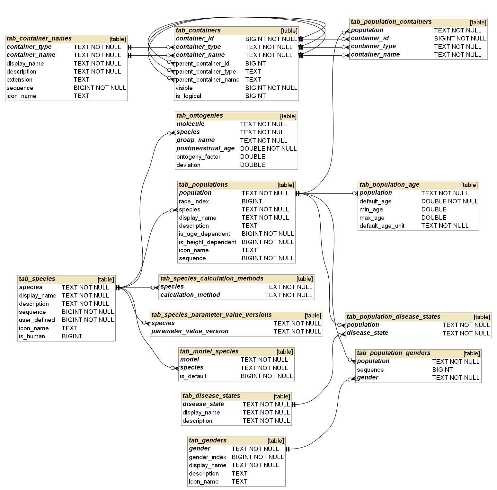

### tab_species
Defines a species.

* **user_defined** <!--(TODO [s. the discussion](https://github.com/Yuri05/DB_Questions/discussions/6))-->

* **is_human** <!--(TODO [s. the discussion](https://github.com/Yuri05/DB_Questions/discussions/7)) -->

### tab_populations
Defines which populations are available for a given species.

* **is_age_dependent** Specifies whether some population parameters have age-dependent information (such parameters are then defined in *[tab_container_parameter_curves](#tab_container_parameter_curves)*). If a population is age dependent:
  * Age must be provided as an input when creating an individual
  * Age range must be provided as an input when creating a population
  * *Aging* option is available when creating a simulation
  * Age dependent *ontogeny information* will be used for proteins etc.
* **is_height_dependent** Specifies whether height information is available for the given population. If a population is height dependent:
  * Height must be provided as an input when creating an individual
  * Height range must be provided as an input when creating a population
  * Organ volumes and some other anatomical parameters are scaled with the height when creating an individual, in simulations with aging etc.
  * Body surface area can be calculated

### tab_genders
Provides definition of all available genders.

### tab_population_genders
Define genders available for a population. If no gender-specific data is available: gender is set to `UNKNOWN`.

### tab_population_age
Defines the age range and the default age for the newly created individuals for all age-dependent populations.

* **default_age_unit** is the default *user interface* unit used when creating individuals/populations for the given population.

### tab_population_containers
Specifies which containers are available for the given population (s. the [Containers](#containers) section for the explanation how this information is used when creating a simulation).

### tab_species_calculation_methods
If a parameter is defined by **formula** - this formula must be described by a *calculation method* (s. the [Calculation methods and parameter value versions](#calculation-methods-and-parameter-value-versions) section for details). In such a case, this calculation method must be assigned to the species, which happens in *tab_species_calculation_methods*.

* E.g. the calculation method `Lumen_Geometry` describes the calculation of some GI-related parameters based on the age and body height, which is currently applicable only to the species `Human`. Thus this calculation method is defined only for `Human` in the table

### tab_species_parameter_value_versions
Is the counterpart of *tab_species_calculation_methods* for parameters defined by a **constant value**. All constant values must be described by a *parameter value version* (s. the [Calculation methods and parameter value versions](#calculation-methods-and-parameter-value-versions) section for details).

One of the reasons for introducing calculation methods and parameter value versions is that sometimes we have **more than one possible alternative** for defining a set of parameters.

* E.g. we have several alternatives for the calculation of body surface area in humans. The corresponding entries in the table *[tab_species_calculation_methods](#tab_species_calculation_methods)* are shown below. 

  | species | calculation_method            |
  | ------- | ----------------------------- |
  | Human   | Body surface area - Du Bois   |
  | Human   | Body surface area - Mosteller |

  The fact that the above calculation methods are **alternatives** is defined by the fact that both have the same **category** defined in *[tab_calculation_methods](#tab_calculation_methods)* (see section [Calculation Methods and Parameter Value Versions](#calculation-methods-and-parameter-value-versions) for details). In PK-Sim, the user then has to select exactly one of these calculation methods (in the above example - during the individual creation, because the described parameters belong to the individual building block).
  
  

### tab_model_species
Defines which species can be used in combination with the given model.

### tab_population_disease_states
The PK-Sim database stores information for **healthy** individuals. For some populations, additional information is available for some disease states. This table indicates which disease states are available for a population. If any:

* User can choose between healthy and one of the diseased states

* If a disease state has been selected: additional input parameters may be required. In the database, these parameters are specified in a parentless container whose name is identical to the name of the selected disease state and with `container_type=DISEASE_STATE`, e.g:

  | container_id | container_type | container_name | parameter_name | group_name     | building_block_type | is_input | …    |
  | ------------ | -------------- | -------------- | -------------- | -------------- | ------------------- | -------- | ---- |
  | 5954         | DISEASE_STATE  | CKD            | eGFR           | DISEASE_STATES | INDIVIDUAL          | 1        | …    |
* Disease-specific parameter values are currently NOT stored in the PK-Sim database. 
  Instead, PK-Sim provides a "DiseaseState" class for each available disease state. In this class, a healthy individual is taken and then modified according to the specification of the given disease state. Examples:
  
    * CKD (Chronic Kidney Disease) disease state: [CKDDiseaseStateImplementation.cs](https://github.com/Open-Systems-Pharmacology/PK-Sim/blob/develop/src/PKSim.Core/Services/CKDDiseaseStateImplementation.cs)
    * HI (Hepatic Impairment) disease state: [HIDiseaseStateImplementation.cs](https://github.com/Open-Systems-Pharmacology/PK-Sim/blob/develop/src/PKSim.Core/Services/HIDiseaseStateImplementation.cs)

    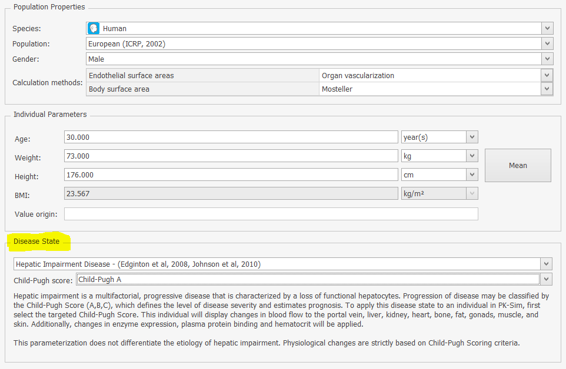

### tab_disease_states
Describes all currently available disease states.

### tab_ontogenies
Defines ontogeny factors for some known proteins for a combination of `{Protein, Species}`
(s. the [Documentation](https://docs.open-systems-pharmacology.org/working-with-pk-sim/pk-sim-documentation/pk-sim-compounds-definition-and-work-flow#basic-physico-chemistry) for details)

* **molecule** name of the protein.
* **species** name of the species
* **group_name** specifies the localization of the ontogeny information:
  * `ONTOGENY_PLASMA` is used to set ontogeny factor for the plasma protein binding (s. [Documentation](https://docs.open-systems-pharmacology.org/working-with-pk-sim/pk-sim-documentation/pk-sim-compounds-definition-and-work-flow#basic-physico-chemistry) for details)
  * For enzymes, transporters and binding partners (other than plasma binding partners), ontogeny information can be stored in 2 different ways:
    * Either the same (global) ontogeny factor for all containers. In this case, the group name is set to `ONTOGENY_LIVER_ALL`
    * Or two ontogeny factors: the first one for the intestine and the second one for the rest of the body. In this case, the group name for these 2 factors is set to `ONTOGENY_DUODENUM` and `ONTOGENY_LIVER_NO_GI`, respectively.
* For for a combination of `{Protein, Species, Group}`, ontogeny information is stored in the form of the supporting points `{Postmenstrual age (PMA), Ontogeny factor, Geometric Standard Deviation}`.
  * If the individual's PMA is equal to one of the supporting points: the corresponding ontogeny factor value is used for the calculation.
  * If the PMA of the individual is less than the minimum PMA of the supporting points: the ontogeny factor corresponding to the minimum PMA is used.
  * If the PMA of the individual is greater than the maximum PMA of the supporting points: the ontogeny factor corresponding to the maximum PMA is used.
  * In other cases, the ontogeny factor is calculated by linear interpolation from two supporting points.

## Container parameters
This section describes the definition of `{Container, Parameter}` combinations.
Another (dynamic) way to define parameters is described in the section [Calculation method parameters](#calculation-method-parameters) below.

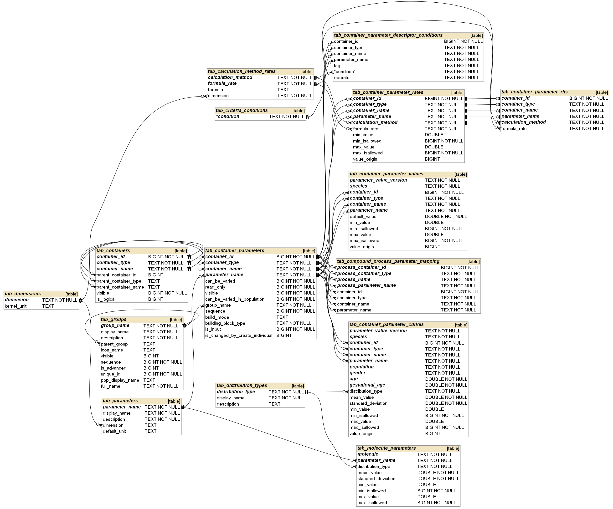

### tab_parameters
Describes an abstract parameter (e.g. "Volume"), which can be inserted in  various containers.

* **dimension** must be one of the dimensions defined in the [OSP Dimensions Repository](https://github.com/Open-Systems-Pharmacology/OSPSuite.Dimensions/blob/master/OSPSuite.Dimensions.xml).
* **default_unit** [OPTIONAL] The default unit to use in the UI (unless the user specifies otherwise). Must be one of the units defined for the parameter dimension in the [OSP Dimensions Repository](https://github.com/Open-Systems-Pharmacology/OSPSuite.Dimensions/blob/master/OSPSuite.Dimensions.xml). If empty: the default unit from the [OSP Dimensions Repository](https://github.com/Open-Systems-Pharmacology/OSPSuite.Dimensions/blob/master/OSPSuite.Dimensions.xml) for the parameter dimension is used.

### tab_dimensions
Lists the available dimensions.

* **dimension** must be one of the dimensions defined in the [OSP Dimensions Repository](https://github.com/Open-Systems-Pharmacology/OSPSuite.Dimensions/blob/master/OSPSuite.Dimensions.xml).
* **kernel_unit** is not used. Is only helpful when creating some database reports etc. Must be identical with the base unit of the corresponding dimension defined in the [OSP Dimensions Repository](https://github.com/Open-Systems-Pharmacology/OSPSuite.Dimensions/blob/master/OSPSuite.Dimensions.xml).

### tab_container_parameters
Specifies a `{Container, Parameter}` combination.

* {**container_id**, **container_type**, **container_name**} specifies the container.

* **parameter_name** specifies the parameter.

* **visible** specifies if the parameter is shown in the PK-Sim UI (when sent to MoBi, this flag is translated into the *Advanced parameter* property.)

* **read_only** specifies if the parameter can be edited by user in the PK-Sim UI

* **can_be_varied** is used to allow the variation of some read-only parameters outside of PK-Sim (e.g. in MoBi or via the R interface).

  Example: for the Arterial Blood container, the following parameters are defined in PK-Sim:

  | container_name | parameter_name                 | can_be_varied | read_only | visible |
  | -------------- | ------------------------------ | ------------- | --------- | ------- |
  | ArterialBlood  | Allometric scale factor        | 0             | 1         | 0       |
  | ArterialBlood  | Density (tissue)               | 1             | 1         | 0       |
  | ArterialBlood  | Fraction vascular              | 1             | 1         | 1       |
  | ArterialBlood  | Peripheral blood flow fraction | 1             | 0         | 1       |
  | ArterialBlood  | Volume                         | 1             | 0         | 1       |
  | ArterialBlood  | Weight (tissue)                | 1             | 1         | 0       |

  If we create a sensitivity analysis in PK-Sim, only the parameters `Peripheral Blood Flow Fraction` and `Volume` will be available for variation because of the flag combination `{visible=1, read_only=0, can_be_varied=1}`.

  However, if we send the simulation to MoBi and create a sensitivity analysis there, all parameters from the table above, except `Allometric Scale Factor`, will be available for variation (in *Advanced Mode*), due to `can_be_varied=1`.

* **can_be_varied_in_population** specifies (together with **is_changed_by_create_individual** - s. below) if a parameter defined by value or by formula (s. below) can be used for the [User Defined Variability‌](https://docs.open-systems-pharmacology.org/working-with-pk-sim/pk-sim-documentation/pk-sim-creating-populations#user-defined-variability) in populations or population simulations.

* **group_name** defines how parameters are displayed in the PK-Sim UI (s. below and also see the description in the [OSP documentation](https://docs.open-systems-pharmacology.org/working-with-pk-sim/pk-sim-documentation/pk-sim-simulations#running-a-simulation-in-an-individual)).

* **build_mode** can be one of the following: `LOCAL`, `GLOBAL`, or `PROPERTY` (s. the [OSP documentation](https://docs.open-systems-pharmacology.org/working-with-mobi/mobi-documentation/model-building-components#parameters-formulas-and-tags) for details).

* **building_block_type** can be one of the following: `COMPOUND`, `EVENT`, `FORMULATION`, `INDIVIDUAL`, `PROTOCOL`, `SIMULATION`. Used to determine which parameters can be added to a container at the building block level and which at the simulation level.

* **is_input** is used to specify whether a parameter that has NOT been changed by the user should be exported to the project snapshot or not.

  Why we need this: some parameters have default values **just for user convenience**. In principle, these values should be empty/NaN by default. However, to reduce the amount of user input required, the parameters have been set to some value. 

  For example, when creating a new compound, the default value is "`Is small molecule = 1`". When the user creates a new small molecule compound, this value is apparently kept AS IS. But in fact it's a user input, which is implicit here, meaning that the value of "`Is small molecule`" must be exported to the snapshot in any case.

* **is_changed_by_create_individual** indicates whether a parameter is changed by the *Create Individual algorithm*. This includes both *directly* modified parameters (= age-dependent parameters specified in *[tab_container_parameter_curves](#tab_container_parameter_curves)*, see below) and *indirectly* modified parameters (such as the blood flows). Parameters with `is_changed_by_create_individual = 1` always appear in the *Distribution* tab of PK-Sim and are not available for user-defined variability.

### tab_groups
Defines the group hierarchy. In the parameter view of individuals/populations/simulations in PK-Sim, each visible parameter is displayed within its group. (s. [OSP Suite documentation](https://docs.open-systems-pharmacology.org/working-with-pk-sim/pk-sim-documentation/pk-sim-creating-individuals#anatomy-and-physiology) for details)

* **parent_group** specifies the parent group (if any). Groups without a parent are displayed at the top level.
* **is_advanced** defines whether the group is displayed in the simple view or only in the advanced view.
* **visible** determines whether the group is visible in the parameter view. If a parameter is visible but belongs to a hidden group, it can still be displayed in either the Hierarchy View mode or in the "All" Parameters group.
* **pop_display_name** [OPTIONAL] is used to display parameters in the "User Defined Variability" and "Distribution" tabs of populations and population simulations. If empty: the **display_name** of the group is used.
* **full_name** is not used by PK-Sim. Shown in MoBi when a simulation is sent from PK-Sim (MoBi does not provide hierarchical parameter view by group like PK-Sim).
* **unique_id** Unique group id used to identify a group in MoBi or when importing a simulation from pkml in PK-Sim. Should never be changed in the DB!
  With each new OSP release a **GroupRepository.xml** file is generated by PK-Sim and placed under **C:\ProgramData\Open Systems Pharmacology\MoBi\X.Y**. Here the complete group information (display name, description, icon, ..) is stored. In pkml files, only the unique group ID is stored. 

### tab_molecule_parameters
Describes some global protein parameters (like "Reference concentration" etc.)

The value of a container parameter can be defined in one of three possible ways:

1. By a *formula* specified in *[tab_container_parameter_rates](#tab_container_parameter_rates)*.

   A formula is neither species nor population dependent.

2. By *constant value* specified in *[tab_container_parameter_values](#tab_container_parameter_values)*.

   A constant value is species dependent but not population dependent.

3. By *age-dependent probability distribution* specified in *[tab_container_parameter_curves](#tab_container_parameter_curves)*.

It is possible, that for a combination {`container_id, container_type, container_name, parameter_name`} we have *several entries* in different tables (e.g. several formulas or formula and value etc.).

When creating a building block or simulation, some entries are filtered out because the calculation method or parameter value version of the entry does not belong to the species/population/model of the created building block/simulation. 

If we still have more than one entry - the corresponding calculation methods or parameter value versions must be of the **same category** (i.e. they represent possible **alternatives** for the parameter definition). See the sections [Species and Populations](#species-and-populations) and [Calculation Methods and Parameter Value Versions](#calculation-methods-and-parameter-value-versions) for more details.

### tab_container_parameter_rates
Defines a formula for the given parameter in the given container.

* **container_id**, **container_type**, **container_name** defines the container.
* **parameter_name** defines the parameter in the given container.
* **calculation_method**, **formula_rate** defines the formula (s. the section [Formulas](#formulas) for more details on formulas).

### tab_container_parameter_values
Defines a constant value for the combination {*Container*, *Parameter*, *Species*, *Parameter Value Version*}.

* **container_id**, **container_type**, **container_name** defines the container.
* **parameter_name** defines the parameter in the given container.
* **species** defines the species.
* **parameter_value_version** defines which parameter value version the given value belongs to (s. the section [Calculation methods and parameter value versions](#calculation-methods-and-parameter-value-versions) for more details).
* **default_value** parameter value for the combination of the properties above.

### tab_container_parameter_curves
Describes age-dependent and/or distributed parameters.

How does it work (all bullet points below apply for a combination 
{`parameter_value_version, species, container_id, container_type, container_name, parameter_name, population, gender, gestational_age`}):

* N supporting age points are defined (N>=1): *Age_min*, … , *Age_max*
* For an individual of given age: *mean* and *sd* value are interpolated based on the mean and sd of defined supported points
  * For `Age < Age_min`: `mean(Age) = mean(Age_min)` and `sd(Age) = sd(Age_min)`
  * For `Age > Age_max`: `mean(Age) = mean(Age_max)` and `sd(Age) = sd(Age_max)`
  * For `Age_min ≤ Age ≤ Age_max`: both *mean* and *sd* are linearly interpolated between their 2 adjacent supporting points (if the *Age* is one of the supporting points, then *mean* and *sd* are obviously taken from it without interpolation).
* Distribution type must be always the same for all ages.
* If we have only age dependency but no distribution, we set `distribution_type=”discrete”` (constant) and `sd = 0` for all supporting points.
* If both *mean* and *sd* are constant for all ages: we define only 1 supporting point (usually with `Age = 0`).

### tab_distribution_types
Lists all available probability distributions.

### tab_compound_process_parameter_mapping
When creating a process in a compound building block, the values of the *Calculation parameters* of this process are taken from the mapped parameters of the **default individual** for the **default population** (the latter is specified in the PK-Sim options) of the species defined by the user during the process creation (see the [OSP Suite documentation](https://docs.open-systems-pharmacology.org/working-with-pk-sim/pk-sim-documentation/pk-sim-compounds-definition-and-work-flow#adme-properties) for details).

### tab_container_parameter_rhs
If a parameter is defined by a differential equation, the right-hand side (RHS) of that equation is given in this table.

### tab_container_parameter_descriptor_conditions
Is used to restrict the creation of local protein parameters to specific containers.

* **tag** Tag of a container in which the parameter should (or should not) be created.
* **condition** Criteria condition for the tag. 
* **operator** Specifies how to combine single criteria conditions for the combination {`container_id, container_type, container_name, parameter_name`}. Must be the same for all entries in this combination. Possible values are 'And' and 'Or'. 

### tab_conditions
Specifies available (container) criteria conditions.
Values must be the same as defined by the [`enum CriteriaCondition`](https://github.com/Open-Systems-Pharmacology/PK-Sim/blob/develop/src/PKSim.Infrastructure/ORM/FlatObjects/CriteriaCondition.cs) in PK-Sim.

<b>Currently not used by PK-Sim</b>

There is another way to describe the value of a container parameter: by an age-dependent probability distribution specified in *[tab_container_parameter_fcurves](#tab_container_parameter_fcurves)*. However, this is currently not used by PK-Sim.

The difference to the *[tab_container_parameter_curves](#tab_container_parameter_curves)* is: the age-dependent parameter value and distribution are not defined by the table of support points, but by 2 analytical functions:

$Mean\ value = f_1(Age,\ ...)$

$Standard\ deviation = f_2(Age,\ ...)$

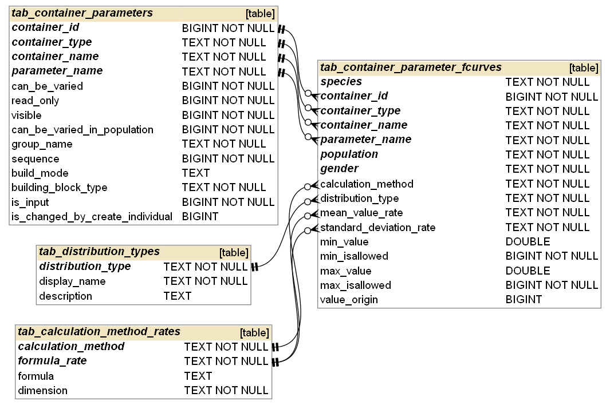

### tab_container_parameter_fcurves
* **calculation_method**, **mean_value_rate** define the age-dependent function of the parameter mean value.
* **calculation_method**, **standard_deviation_rate** define the age-dependent function of the parameter standard deviation.
* all other columns have the same meaning as in the *[tab_container_parameter_curves](#tab_container_parameter_curves)*.

## Calculation method parameters
Apart from the container parameters described above, some parameters are created *dynamically* when the model uses a particular calculation method.

Some calculation methods rely on a large number of **supporting parameters**, which are only used to create other parameters and are of no interest once the "main" parameters are created.

To avoid adding tons of supporting parameters for all possible combinations of calculation methods, the concept of "Calculation method parameters" was introduced, which allows adding supporting parameters on demand.

To enable calculation method parameters also in MoBi: with each new OSP release a **AllCalculationMethods.pkml** file is generated by PK-Sim and placed under **C:\ProgramData\Open Systems Pharmacology\MoBi\X.Y**. Here the complete supporting parameter information (parameter properties, location, formula) is stored. 

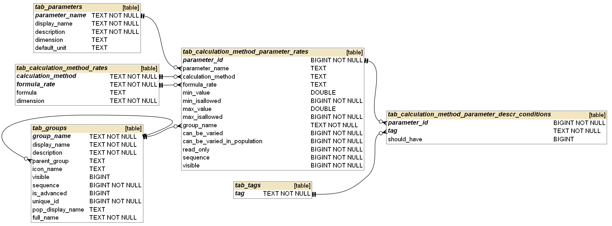

### tab_calculation_method_parameter_rates
Defines which parameters are added dynamically.
Another task of this table is to dynamically assign formulas to the "main" parameters initially defined by a *black-box formula*. The latter is described in more detail in the section [Black Box Formulas](#black-box-formulas).

* **parameter_id** unique id, only used internally in the database.
* **parameter_name** name of the supporting parameter to add.
* **group_name**, **can_be_varied**, **can_be_varied_in_population**, **read_only**, **visible** have the same meaning as for the container parameters.
* {**calculation_method**, **rate**} define for which calculation method and with which formula the parameter will be added.

### tab_calculation_method_parameter_descr_conditions
Defines the containers in which a supporting parameter should be created. Containers are described by their tags; single criteria conditions for a parameter id are combined by `AND`.

## Formulas
This section describes the formulas defined in the PK-Sim database. This includes:

* formulas defined by an analytical equation (*explicit formulas*) 
* *sum formulas*
* table formulas with offset
* table formulas with X argument

An **explicit formula** is defined by the equation $f(P_1, ... P_n; M_1, ..., M_k; C_1, ... C_j; TIME)$ where:

* $f$ is an analytical function
* $P_1, ... P_n$ ($n \geq 0$) are model parameters 
* $M_1, ..., M_k$ ($k \geq 0$) are molecule amounts 
* $C_1, ... C_j$ ($j \geq 0$) are molecule concentrations
* $TIME$ is the current time (related to the begin of the simulation run)

A **sum formula** is defined by the equation $f(P_1, ... P_n; M_1, ..., M_k; C_1, ... C_j; TIME;$ `Q_#i` $)$ where:

* `Q_#i` is a *control variable* (parameter, molecule amount, etc.) defined by certain conditions
* all other arguments have the same meaning as in an explicit formula

A **table formula with offset** is defined by 2 quantities (see the [OSP documentation](https://docs.open-systems-pharmacology.org/working-with-mobi/mobi-documentation/model-building-components#working-with-table-formulas-with-offset) for details):

* **table object** with the `Table_formula` (defined by the support points { $time_i;value_i$} )
* **offset object** with the `Offset_formula`.

The X argument of the table object is always the (simulation) time, and the formula returns the value
`Table_formula(Time - Offset_formula(Time;...))`.

A **table formula with X argument** is a generalization of *table formula with offset* and is defined by 2 quantities

* **table object** with the `Table_formula` (defined by the support points { $x_i;value_i$} ).
* **X argument object** with the `XArgument_formula`.

The table's X argument is arbitrary, and the formula returns the value
$Table\_formula(XArgument\_formula(...))$.

S. the OSP Suite documentation: [Working with Formulas‌](https://docs.open-systems-pharmacology.org/working-with-mobi/mobi-documentation/model-building-components#working-with-formulas) and [Sum Formulas](https://docs.open-systems-pharmacology.org/working-with-mobi/mobi-documentation/model-building-components#sum-formulas) for more details on formulas.

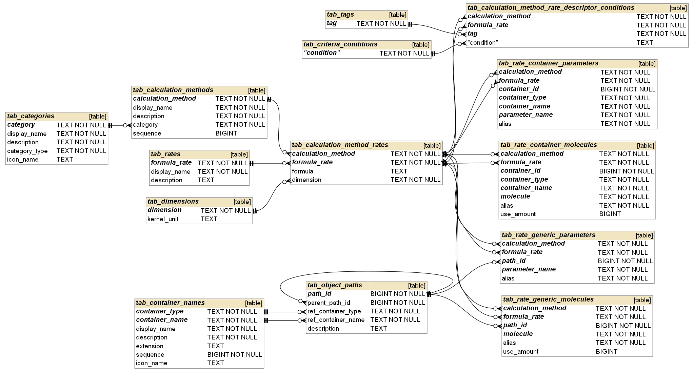

### tab_rates
Describes an abstract formula.

### tab_calculation_methods
Describes a calculation method. A calculation method describes how a **group of quantities** (parameters, molecule initial values, etc.) are defined by their formulas. A decision about which quantities should be described by the same calculation method is usually based on information about which formulas would change when the user switches from one (sub)model to another. For example, if the user chooses a different method for calculating the *Body Surface Area* (BSA) - only the BSA parameter itself is affected, and thus only this parameter is described by the corresponding calculation methods. If the user chooses another method for calculating the surface area between the plasma and the interstitial space - the *Surface Area (Plasma/Interstitial)* parameters in all tissues organs are affected: thus all these parameters are grouped in the same calculation method.

* **category** calculation methods belonging to the same category are alternatives, which can be selected by user (s. also the section [Container Parameters](#container-parameters))

### tab_categories
Specifies the categories of calculation methods.

* **category_type** describes for which building block or simulation all calculation methods of the given category are valid. For example, if the category type of a calculation method is "Individual" - the calculation method will be used when creating an individual. Valid values of the category type are defined by the [`enum CategoryType`](https://github.com/Open-Systems-Pharmacology/PK-Sim/blob/develop/src/PKSim.Core/Model/Category.cs).

### tab_calculation_method_rates
Defines the formula equation for the combination {`calculation_method, formula_rate`}.

* **calculation_method** defines the calculation method. Some calculation methods have a special meaning and are described in more detail in the next subsections:
  * `BlackBox_CalculationMethod`
  * `DynamicSumFormulas`
  * `DiseaseStates`
* **formula_rate** defines the formula. 
  * For some frequently used constant rates specific formulas were defined:
    * `Zero_Rate`
    * `One_Rate`
    * `Thousand_Rate`
    * `NaN_Rate`
  * Some calculation methods have a special meaning and are described in more detail in the next subsections:
    * `TableFormulaWithOffset_*`
    * `TableFormulaWithXArgument_*`
  
* **formula** defines the equation for the combination {`calculation_method, formula_rate`}. Which operators, standard functions, etc. are allowed is described in the [OSP Suite documentation - Working with Formulas](https://docs.open-systems-pharmacology.org/working-with-mobi/mobi-documentation/model-building-components#working-with-formulas). 
  * It is allowed to leave the **formula** field empty. Quantity with empty formula becomes mandatory user input in PK-Sim UI. This means that only **visible and editable quantities** are allowed to have an empty formula.
  * Formula can be set to $\pm \infty$. Valid values for this are:
    * `Inf` or `Infinity`
    * `-Inf` or `-Infinity`

  * It is important to write **efficient formulas**. Check the [WIKI **Writing efficient formulas**](https://github.com/Open-Systems-Pharmacology/OSPSuite.FuncParser/wiki/Writing-efficient-formulas) for details.
  * Constant values in equations should be avoided. It is always better to define a new parameter, set it to the constant value, and then use that parameter in the equation. Exceptions are constants whose meaning is immediately clear (e.g. `1`, `0`, `ln(2)`, etc.). Because: 
    * In the parameter definition, we can add description, value origin, etc. All of this information is missing when you use a constant directly in an equation.
    * Unit information is lost and this can easily lead to errors (happens quite often in MoBi, when users add constants to their formulas, see e.g. [this discussion](https://github.com/Open-Systems-Pharmacology/Forum/issues/491)).
  
* **dimension** the dimension of the formula. Used e.g. by the dimension check in MoBi to make sure that the quantities using the given formula have the same dimension.

### tab_rate_container_parameters
Parameters referenced by the formula of the combination {`calculation_method, formula_rate`}. Parameters are given by the combination of {`container_id, container_type, container_name, parameter_name`}.

* **alias** is the alias of the referenced parameter used in the calculation. The rules for defining aliases are
  * Aliases of all quantities referenced in the formula must be unique and not empty.
  * Alias cannot be a number.
  * Alias must not contain any of the characters 
    `+ - * \ / ^ . , < > = ! ( ) [ ] { } ' " ? : ¬ | & ;`
  * Alias must not contain blanks.
  * Alias cannot be one of the predefined *standard constants* (s. the [OSP Suite documentation - Working with Formulas](https://docs.open-systems-pharmacology.org/working-with-mobi/mobi-documentation/model-building-components#working-with-formulas)).
  * Alias cannot be one of the predefined *standard functions* (s. the [OSP Suite documentation - Working with Formulas](https://docs.open-systems-pharmacology.org/working-with-mobi/mobi-documentation/model-building-components#working-with-formulas)).
  * Alias cannot be one of the predefined *logical operators* (s. the [OSP Suite documentation - Working with Formulas](https://docs.open-systems-pharmacology.org/working-with-mobi/mobi-documentation/model-building-components#working-with-formulas)).

### tab_rate_container_molecules
Molecules referenced by the formula of the combination {`calculation_method, formula_rate`}. Molecules are given by the combination of {`container_id, container_type, container_name, molecule`}.

* **alias** is the alias of the referenced parameter used in the calculation. Alias rules apply (s. above).
* **use_amount** specifies whether the *amount* or *concentration* of the given molecule is used.

### tab_rate_generic_parameters
Parameters referenced by the formula of the combination {`calculation_method, formula_rate`}. Parameters are given by the combination of {`path_id,  parameter_name`}.

* **path_id** refers to the (relative) object path stored in the table *[tab_object_paths](#tab_object_paths)* (s. below).
* **alias** is the alias of the referenced parameter used in the calculation. Alias rules apply (s. above).

### tab_rate_generic_molecules
Parameters referenced by the formula of the combination {`calculation_method, formula_rate`}. Parameters are given by the combination of {`path_id,  molecule`}.

* **path_id** refers to the (relative) object path stored in the table *[tab_object_paths](#tab_object_paths)* (s. below).
* **alias** is the alias of the referenced molecule used in the calculation. Alias rules apply (s. above).
* **use_amount** specifies whether the *amount* or *concentration* of the given molecule is used.

There are some "special" containers defined in *[tab_container_names](#tab_container_names)* that are not used in the container hierarchy defined in *[tab_containers](#tab_containers)*. These containers are only used for **referential integrity when defining some relative object paths**. (TODO s. [the issue](https://github.com/Open-Systems-Pharmacology/PK-Sim/issues/2692))

<b>Special containers</b>

| ref_container_name     | description                                                 |
| ---------------------- | ----------------------------------------------------------- |
| .                      | Me                                                          |
| ..                     | Parent                                                      |
| \<COMPLEX\>              | Dummy, will be replaced by complex name in PK-Sim           |
| \<FormulationName\>      | \<FormulationName\>                                           |
| \<MOLECULE\>             | Dummy, will be replaced by compound name in PK-Sim          |
| \<PROCESS\>              | Template for Compound process in simulation                 |
| \<PROTEIN\>              | Template for protein                                        |
| \<REACTION\>             | Dummy, will be replaced by reaction name in PK-Sim          |
| ALL_FLOATING_MOLECULES | Path entry referencing all floating molecules (Assignments) |
| FIRST_NEIGHBOR         | Path entry for the first neighbor                           |
| FcRn                   | FcRn                                                        |
| FcRn_Complex           | FcRn_Complex                                                |
| LigandEndo             | LigandEndo                                                  |
| LigandEndo_Complex     | LigandEndo_Complex                                          |
| NEIGHBORHOOD           | Path entry for the neighborhood                             |
| SECOND_NEIGHBOR        | Path entry for the second neighbor                          |
| SOURCE                 | Path entry for source amount                                |
| TARGET                 | Path entry for target amount                                |
| TRANSPORT              | Path entry for the transport                                |

### tab_object_paths
Describes (relative) paths of quantities used in a formula (see the [OSP Suite documentation - Working with Formulas](https://docs.open-systems-pharmacology.org/working-with-mobi/mobi-documentation/model-building-components#working-with-formulas) for details). Each entry of an object path is stored separately, with its own id and the id of its parent path entry. Tables *tab_rate_generic_XXX* have the reference to the **bottom element of the object path** (see the example below).

* **path_id** is the unique id of the path entry.
* **parent_path_id** is the id of the parent path entry. If there is no parent path entry: the parent path id is set equal to the path id!
* {**ref_container_type**, **ref_container_name**} name and type of the container which is referenced by the path entry.

Example: 

*tab_object_paths* contains the following path entries:

| path_id | parent_path_id | ref_container_type | ref_container_name  |
| ------- | -------------- | ------------------ | ------------------- |
| 260     | 259            | GENERAL            | MOLECULE            |
| 259     | 2078           | NEIGHBORHOOD       | Brain_pls_Brain_int |
| 2078    | 2078           | GENERAL            | Neighborhoods       |

These entries represent the path `Neighborhoods|Brain_pls_Brain_int|MOLECULE`.

In *[tab_rate_generic_parameters](#tab_rate_generic_parameters)* the path is referenced like this:

| calculation_method                                   | formula_rate                  | path_id | parameter_name                              | alias     |
| ---------------------------------------------------- | ----------------------------- | ------- | ------------------------------------------- | --------- |
| Interstitial partition coefficient method  - Schmitt | PARAM_K_water_int_brn_Schmitt | **260** | Partition coefficient (interstitial/plasma) | K_int_pls |

With this, the full path to the referenced parameter is:  
`Neighborhoods|Brain_pls_Brain_int|MOLECULE|Partition coefficient (interstitial/plasma)`

#### Sum formulas
See the [OSP Suite documentation - Sum Formulas](https://docs.open-systems-pharmacology.org/working-with-mobi/mobi-documentation/model-building-components#sum-formulas) for more details.

Sum formulas in the PK-Sim database must have the calculation method **DynamicSumFormulas**.

Compared to the full flexibility of the sum formulas provided in MoBi, there are some restrictions:

* *Control variable* (`Q` in the screenshot below) can only be defined **with 1 letter**.
* Quantity references **relative to the summed object** (the highlighted part of the definition below) are not possible.
* The operator for combining the conditions of each criterion is always `And'.

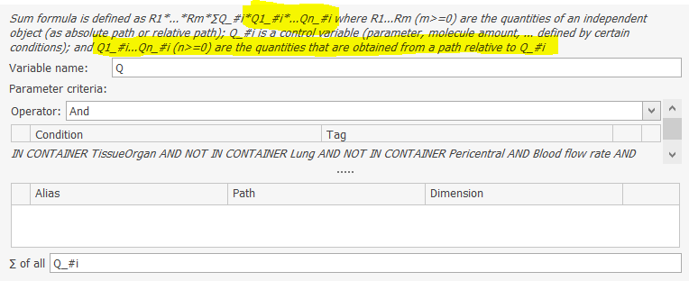

### tab_calculation_method_rate_descriptor_conditions
Defines the criteria of the quantities to be summed up for the combination {`calculation_method, rate`}.

* **condition** criteria condition for the target container.
* **tag** the tag of the single condition.

### tab_conditions
Specifies available (container) criteria conditions.
Values must be the same as defined by the [`enum CriteriaCondition`](https://github.com/Open-Systems-Pharmacology/PK-Sim/blob/develop/src/PKSim.Infrastructure/ORM/FlatObjects/CriteriaCondition.cs) in PK-Sim.

#### "Black box" formulas
Some molecule-dependent parameters defined within the spatial structure have a formula that depends on the calculation methods of the specific molecule. Examples of such parameters are partition coefficients, cellular permeabilities, etc.

Within the spatial structure, these parameters are defined by a dummy formula - *black-box formula* - which is replaced by a concrete formula for each molecule.

All black box formulas are combined within the calculation method `BlackBox_CalculationMethod'.

The concrete (calculation method dependent) formulas are then defined in the table *[tab_calculation_method_parameter_rates](#tab_calculation_method_parameter_rates)* (and exported to **AllCalculationMethods.pkml** for MoBi) - see the section [Calculation method parameters](#calculation-method-parameters). 

Example of how black box parameters are displayed in MoBi:

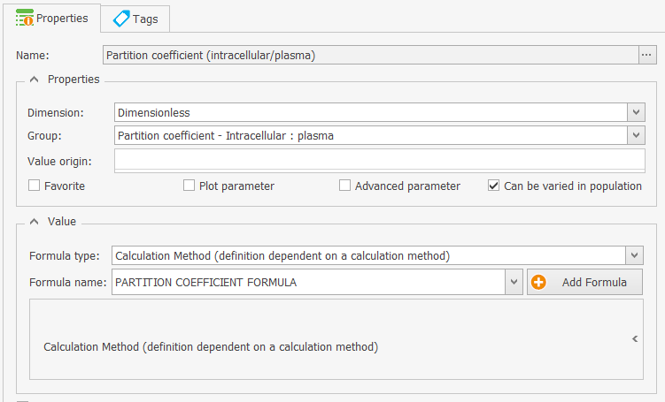

#### Disease state parameters

Parameters specific to disease states are grouped under the `DiseaseStates` calculation method.

#### Table formulas with offset

If a formula_rate starts with the prefix **TableFormulaWithOffset_** (e.g. `TableFormulaWithOffset_FractionDose`) - PK-Sim will create a table formula with offset.

PK-Sim then expects that **exactly 2 referenced quantities are defined for the formula**: one quantity with the alias `Table` and another quantity with the alias `Offset`. Example:

| calculation_method   | formula_rate                        | path_id | parameter_name  | alias      |
| -------------------- | ----------------------------------- | ------- | --------------- | ---------- |
| ApplicationParameter | TableFormulaWithOffset_FractionDose | 139     | Start time      | **Offset** |
| ApplicationParameter | TableFormulaWithOffset_FractionDose | 253     | Fraction (dose) | **Table**  |

#### Table formulas with X argument

If a formula_rate starts with the prefix **TableFormulaWithXArgument_** (e.g. `TableFormulaWithXArgument_Solubility`) - PK-Sim will create a table formula with X Argument.

PK-Sim then expects, that **exactly 2 referenced quantities are defined for the formula**: one quantity with the alias `Table` and another quantity with the alias `XArg`. Example:

| calculation_method | formula_rate                         | path_id | parameter_name   | alias     |
| ------------------ | ------------------------------------ | ------- | ---------------- | --------- |
| Lumen_PKSim        | TableFormulaWithXArgument_Solubility | 140     | pH               | **XArg**  |
| Lumen_PKSim        | TableFormulaWithXArgument_Solubility | 240     | Solubility table | **Table** |

## Calculation methods and parameter value versions
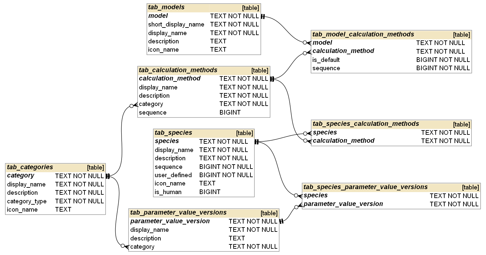

### tab_models
Defines available PBPK models, which can be selected during the simulation creation (e.g. "Small molecules model", "Large molecules model" etc.).

* **short_display_name** is used in some places in the UI, where the fully qualified model display name is too long.

### tab_calculation_methods
Defines a *calculation method* (**CM**). A calculation method describes how a **group of quantities** (parameters, molecule initial values, etc.) are defined by their formulas. A decision about which quantities should be described by the same CM is usually based on information about which formulas would change when the user switches from one (sub)model to another. For example, if the user chooses a different method for calculating the *Body Surface Area* (BSA) - only the BSA parameter itself is affected, and thus only this parameter is described by the corresponding calculation method. If the user chooses another method for calculating the surface area between the plasma and the interstitial space - the *Surface Area (Plasma/Interstitial)* parameters in all tissues organs are affected: thus all these parameters are grouped in the same calculation method. More details on calculation methods are provided in the section [Formulas](#formulas).

* **category** calculation methods belonging to the same category are alternatives, which can be selected by user.

### tab_parameter_value_versions
Defines a *parameter value version* (**PVV**). A parameter value version describes how a **group of parameters** are defined by their constant values or their distributions. A decision about which parameters should be described by the same PVV is usually based on information about which parameters would change when the user switches from one PVV to another. More details on parameter value versions are provided in the sections [Species and populations](#species-and-populations) and [Container parameters](#container-parameters).

### tab_categories
Specifies the categories of calculation methods and parameter value versions.

* **category_type** describes for which building block or simulation all calculation methods or parameter value versions of the given category are valid. For example, if the category type of a calculation method is "Individual" - the calculation method will be used when creating an individual. Valid values of the category type are defined by the [`enum CategoryType`](https://github.com/Open-Systems-Pharmacology/PK-Sim/blob/develop/src/PKSim.Core/Model/Category.cs).

### tab_species_calculation_methods
Defines which calculation methods are available for the given species.

### tab_species_parameter_value_versions
Is the counterpart of *tab_species_calculation_methods* and defines which parameter value versions are available for the given species.

### tab_model_calculation_methods
Defines which calculation methods are available for a model.

Now, when it comes to creating a building block or simulation, the algorithm for determining which CMs and PVVs to use is as follows:

1. Identify all PVVs with the category type corresponding to the type of the block/simulation.
2. If the building block type is "Individual": remove all PVVs that are not assigned to the species of the individual (via *tab_species_parameter_value_versions*).
3. Group all remaining PVVs according to their category. 
   * For each group with $\geq$ 2 PVVs: these PVVs are **alternatives** and the user has to choose exactly one of them to be used in the building block/simulation.
4. Identify all CMs with the category type corresponding to the type of the block/simulation.
5. If the building block type is "Individual": remove all CMs that are not assigned to the species of the individual (via *tab_species_calculation_methods*).
6. Group all remaining CMs according to their category. 
   * For each group with $\geq$ 2 CMs: these CMs are **alternatives** and the user has to choose exactly one of them to be used in the building block/simulation.

## Applications and formulations
*Applications* are containers with container_type="APPLICATION"`.

*Formulations* are containers with container_type="FORMULATION"`.

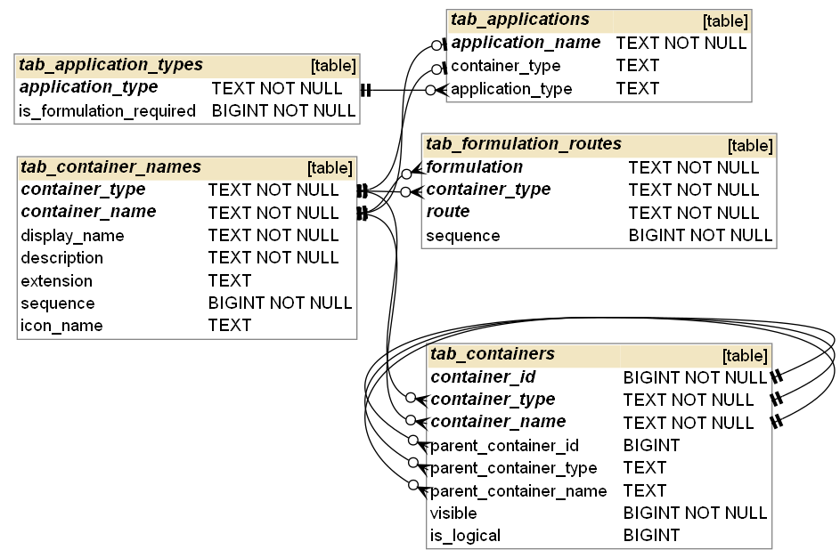

In the container hierarchy (defined in *[tab_containers](#tab_containers)*):

* Formulations are always top-level containers with no parent.
* Applications always have a formulation as parent container.
  * For applications that do not require a formulation (e.g. IV), `Formulation_Empty` is defined as the parent container.

| Id   | Type        | Name                   | ParentId | ParentType  | ParentName                 |
| ---- | ----------- | ---------------------- | -------- | ----------- | -------------------------- |
| 1725 | APPLICATION | Intravenous            | 1718     | FORMULATION | Formulation_Empty          |
| 1724 | APPLICATION | IntravenousBolus       | 1718     | FORMULATION | Formulation_Empty          |
| 1722 | APPLICATION | Oral_Dissolved         | 1717     | FORMULATION | Formulation_Dissolved      |
| 5101 | APPLICATION | Oral_Particles         | 5100     | FORMULATION | Formulation_Particles      |
| 5268 | APPLICATION | Oral_Table             | 5262     | FORMULATION | Formulation_Table          |
| 5045 | APPLICATION | Oral_Tablet_Lint80     | 5044     | FORMULATION | Formulation_Tablet_Lint80  |
| 1728 | APPLICATION | Oral_Tablet_Weibull    | 1720     | FORMULATION | Formulation_Tablet_Weibull |
| 5344 | APPLICATION | UserDefined_Dissolved  | 1717     | FORMULATION | Formulation_Dissolved      |
| 5239 | APPLICATION | UserDefined_FirstOrder | 1719     | FORMULATION | Formulation_FirstOrder     |
| 5284 | APPLICATION | UserDefined_Table      | 5262     | FORMULATION | Formulation_Table          |
| ...  | ...         | ...                    | ...      | ...         | ...                        |

Each application has a `ProtocolSchemaItem` subcontainer which stores some parameters common to all applications (e.g. `Start time`, `Dose`, etc.) and some application specific parameters (e.g. `Amount of water` for oral applications).

Each application also has an `Application_StartEvent` subcontainer that defines the application start event.

Most applications have an `Application_StopEvent` subcontainer that defines the application stop event.

Other application subcontainers are application specific (e.g. transport(s) *Application* ▶️ *Organism*, other subcontainers, etc.). For example, for the *Intravenous* (infusion) application has the following subcontainers:

| container_id | container_type | container_name         | parent_container_id | parent_container_type | parent_container_name |
| ------------ | -------------- | ---------------------- | ------------------- | --------------------- | --------------------- |
| 1731         | GENERAL        | ProtocolSchemaItem     | 1725                | APPLICATION           | Intravenous           |
| 1739         | EVENT          | Application_StartEvent | 1725                | APPLICATION           | Intravenous           |
| 1745         | EVENT          | Application_StopEvent  | 1725                | APPLICATION           | Intravenous           |
| 1748         | PROCESS        | Intravenous_Transport  | 1725                | APPLICATION           | Intravenous           |

### tab_formulation_routes
Defines the formulations.

* **formulation** is the name of the formulation.
* **container_type** is always "FORMULATION".
* **route** is the route of administration (IV, oral, dermal, ...) for which the formulation is intended.

### tab_applications
Defines the top container of an application.

* **application_name** is the name of the application.
* **container_type** is always "APPLICATION".
* **application_type** is the route of administration (TODO rename, s. [the Issue](https://github.com/Open-Systems-Pharmacology/PK-Sim/issues/2309))

### tab_application_types
Defines all available administration routes (TODO rename, s. [the Issue](https://github.com/Open-Systems-Pharmacology/PK-Sim/issues/2309))

* **application_type** is the route of administration (TODO rename, s. [the Issue](https://github.com/Open-Systems-Pharmacology/PK-Sim/issues/2309))
* **is_formulation_required** indicates whether a formulation definition is required for the given route.

## Events
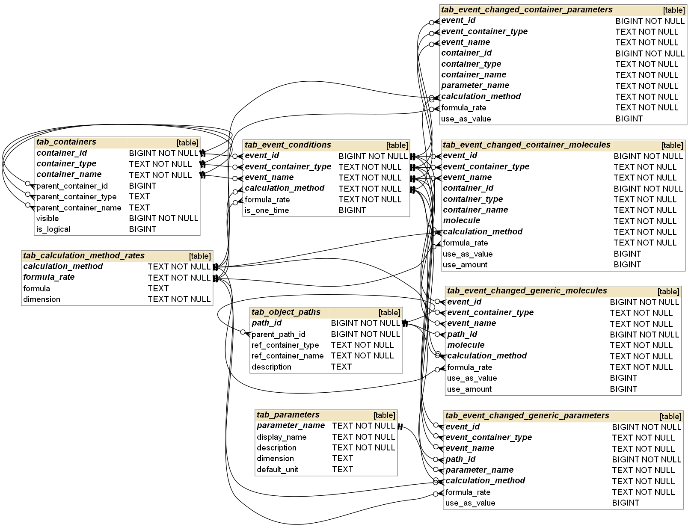

*Events* are containers with `container_type="EVENT"`.

In the container hierarchy (defined in *[tab_containers](#tab_containers)*) event are usually children of containers of type "`APPLICATION`" or "`EVENTGROUP`".

Each event is described by the event condition and the quantities that are changed by this event.

### tab_event_conditions
Defines the event condition of an event.

* {**event_id**, **event_container_type**, **event_name**} are the id, type and name of the event container.
* {**calculation_method**, **formula_rate**} define the formula of the event condition (typically a boolean formula which can return only 0 or 1).
* **is_one_time** specifies whether the event is triggered *whenever the event condition is met* (`is_one_time=0`) or only at the *first simulation time point* when the event condition is met.

### tab_event_changed_container_molecules

### tab_event_changed_container_parameters

### tab_event_changed_generic_molecules

### tab_event_changed_generic_parameters

Define which parameters or molecule amounts are modified by an event. The referencing of the modified quantities of an event is done in the same way as the referencing of the quantities used in a formula and defined in the tables *[tab_rate_container_molecules](#tab_rate_container_molecules)*, *[tab_rate_container_parameters](#tab_rate_container_parameters)*, *[tab_rate_generic_molecules](#tab_rate_generic_molecules)*, *[tab_rate_generic_parameters](#tab_rate_generic_parameters)* (s. the section [Formulas](#formulas)) for details.

* {**event_id**, **event_container_type**, **event_name**} are the id, type and name of the event container.
* {**calculation_method**, **formula_rate**} defines the formula that will be applied to the changed quantity when the event is triggered.
* **use_as_value** defines if the formula is assigned as a formula or as a value of the formula, calculated at the time point of the assignment.
* **use_amount** (TODO delete - s. [the issue](https://github.com/Open-Systems-Pharmacology/PK-Sim/issues/2696))

S. the [OSP Documentation on events](https://docs.open-systems-pharmacology.org/working-with-mobi/mobi-documentation/model-building-components#event-groups-and-events) for more details.

## Observers
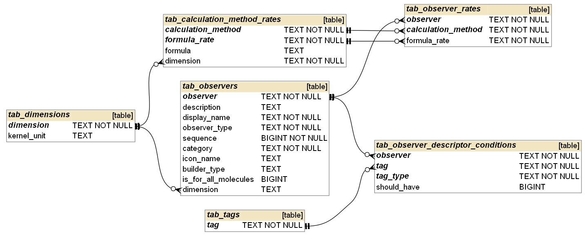

### tab_observers
Specifies an observer.

* **observer** name of the observer.
* **observer_type** <!--TODO s. [the discussion](https://github.com/Yuri05/DB_Questions/discussions/9).-->
* **category** always set to `"Observer"`. <!--(TODO [s. the discussion](https://github.com/Yuri05/DB_Questions/discussions/10)).-->
* **builder_type** "`AMOUNT`" or "`CONTAINER`", which corresponds to "Molecule Observer" and "Container Observer in MoBi" (s. the [OSP Suite documentation](https://docs.open-systems-pharmacology.org/working-with-mobi/mobi-documentation/building-block-concepts#observers) for details).
* **is_for_all_molecules** <!--(TODO s. [the discussion](https://github.com/Yuri05/DB_Questions/discussions/11))-->
* **dimension** dimension of the observer.

### tab_observer_rates
Defines the monitor formula of the observer.

### tab_observer_descriptor_conditions
Defines criteria for containers where the observer will be created. Single container criteria are combined by "`AND`".

* **observer** name of the observer.
* **tag** is a tag of a container in which the observer should (or should not) be created.
* **tag_type** Is always set to "`PARENT`" <!--(TODO [s. the discussion](https://github.com/Yuri05/DB_Questions/discussions/12))-->
* **should_have** specifies whether the target container should or should not have the given tag.. 

## Entities defined by formulas
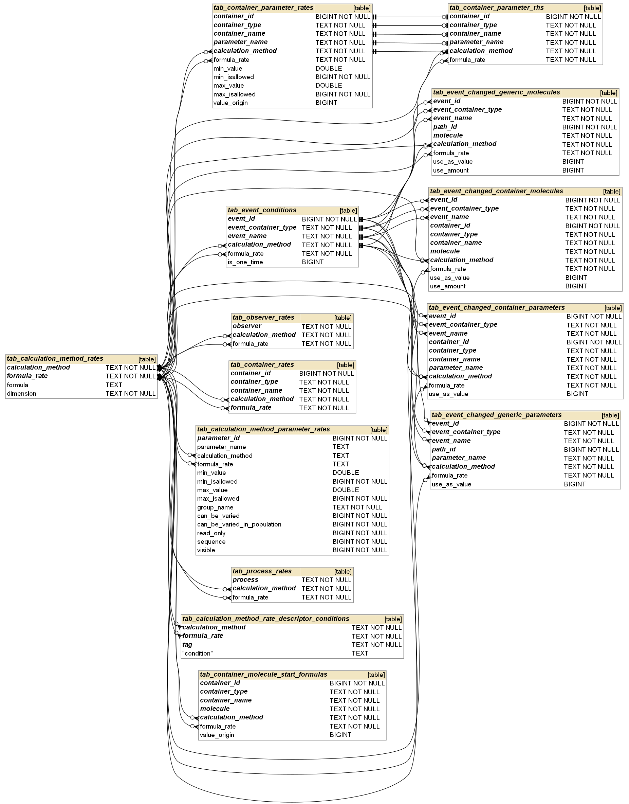

The picture above shows an overview of all quantities which are described by a formula. Most tables are explained in other sections.

### tab_container_rates
Is currently not used. This table was introduced to define some conditions which cannot be described by the boundary criteria (min/max) of a quantity. E.g. for the condition "Sum of compartment fractions of an organ = 1".

## Proteins
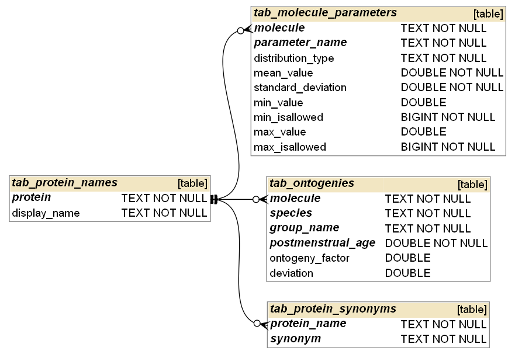

### tab_protein_names
Stores the names of known proteins.

### tab_protein_synonyms
Stores synonyms of the protein names.

**tab_ontogenies** is described in detail [above](#tab_ontogenies).

**tab_molecule_parameters** is described in detail [above](#tab_molecule_parameters).

## Models
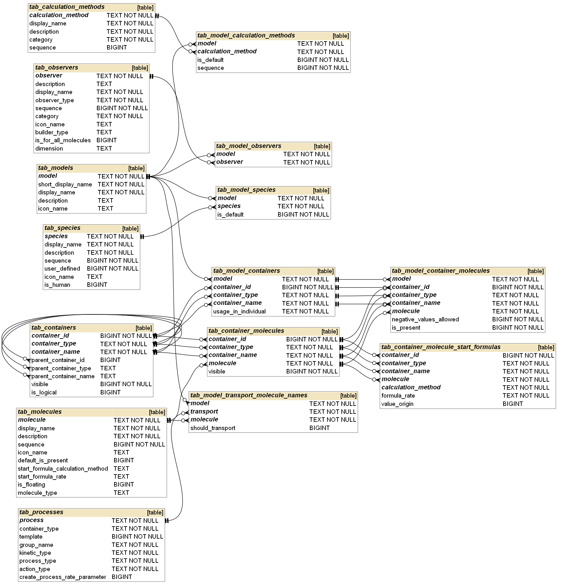

**tab_models** defines available PBPK models and is described [above](#tab_models).

**tab_model_calculation_methods** is described [above](#tab_model_calculation_methods).

### tab_model_observers
Defines which observers are available for the given model.

**tab_model_species** defines which species can be used in combination with the given model and is described [above](#tab_model_species).

**tab_model_containers** defines which containers **can** be included into the final model and is described [above](#tab_model_containers).

### tab_molecules
Defines the **default** properties (start amount, *IsPresent*, etc.) for administered compounds and endogenous molecules. For each model container, these default settings can be **overwritten** by entries in *[tab_container_molecule_start_formulas](#tab_container_molecule_start_formulas)* and *[tab_model_container_molecules](#tab_model_container_molecules)* (s. below)

* **molecule** the name of the molecule.
* **default_is_present** is the molecule present as per default. 
* **start_formula_calculation_method**, **start_formula_rate** defined the default start formula for the molecule. E.g. for administered compounds start formula is always zero; etc.
* **is_floating** defines whether the molecule is floating or stationary.
* **molecule_type** type of the molecule (administered compound, Enzyme, Transporter, etc.)

**tab_model_transport_molecule_names** restricts which molecules are transported by a passive transport for particular model and is described [above](#tab_model_transport_molecule_names).

### tab_container_molecules
Used for referential integrity only; not exposed to PK-Sim. <!--(TODO s. [the discussion](https://github.com/Yuri05/DB_Questions/discussions/13))-->

### tab_model_container_molecules
Overwrites some default (global) molecule properties on the model container level.

* **negative_values_allowed** overrides the default setting (**FALSE**; defined programmatically and not in the database).
* **is_present** overrides the global molecule setting defined in *[tab_molecules](#tab_molecules)*.

### tab_container_molecule_start_formulas
Overwrites some default (global) molecule properties on the model container level.

* **calculation_method**, **formula_rate** overrides the global molecule start amount formula in *[tab_molecules](#tab_molecules)*.

## Tags
The picture below describes for which objects *descriptor criteria* (*descriptor conditions*) are defined in the database.

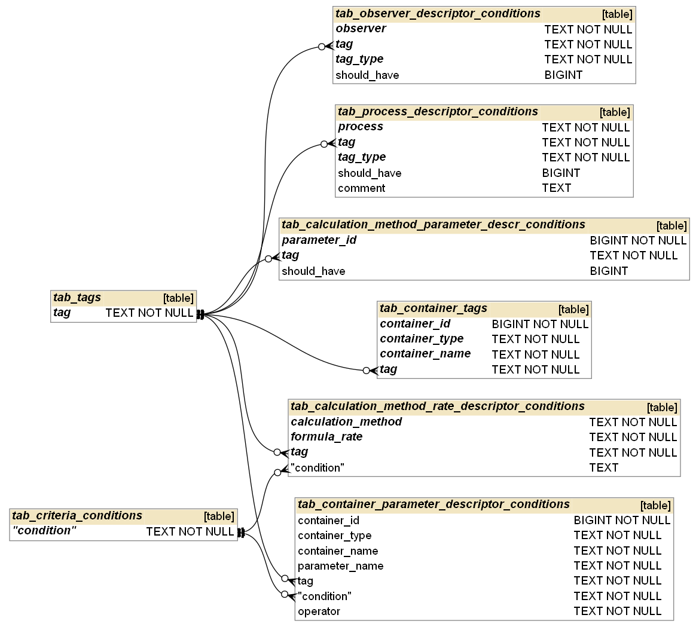

### tab_tags
Defines all possible tags. The *name* of each container is added as tag programmatically in **OSPSuite.Core**. So there is no need to insert all container names into *tab_tags* or *tab_container_tags*.

### tab_criteria_conditions
Describes all available conditions. Each condition must be available in the [`enum CriteriaCondition`](https://github.com/Open-Systems-Pharmacology/PK-Sim/blob/develop/src/PKSim.Infrastructure/ORM/FlatObjects/CriteriaCondition.cs) in PK-Sim.

All other tables are explained in the previous sections.

## Value origins
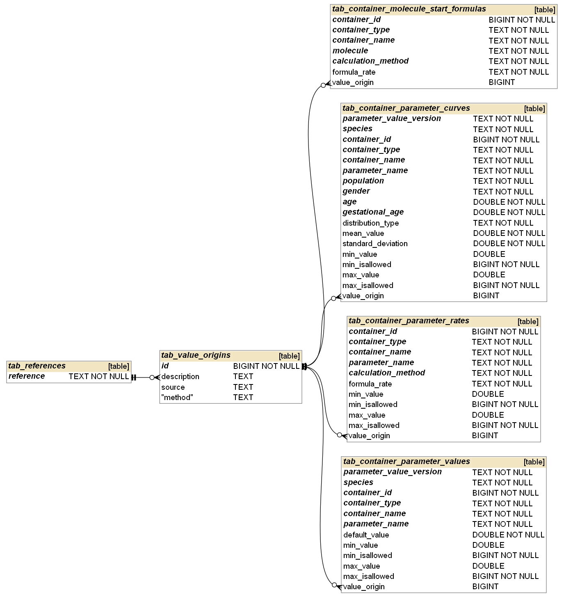

Value origin describes the data source of a value or formula.

### tab_references
Describes a data source (e.g. publication).

### tab_value_origins
Describes available value origins.

* **id** is the unique id of a value origin. This id is used in all referencing tables.
* **description** is either empty or refers an entry in *tab_references*.
* **source** must be one of the values define in [enum ValueOriginSourceId](https://github.com/Open-Systems-Pharmacology/OSPSuite.Core/blob/develop/src/OSPSuite.Core/Domain/ValueOriginSource.cs) (database default: "`Undefined`").
* **method** must be one of the values define in [enum ValueOriginDeterminationMethodId](https://github.com/Open-Systems-Pharmacology/OSPSuite.Core/blob/develop/src/OSPSuite.Core/Domain/ValueOriginDeterminationMethod.cs) (database default: "`Undefined`").

## Representation Info
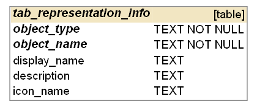

### tab_representation_info
Defines the display properties (display name, description, icon) for some entities, which are not covered by other database tables.

# Full schema
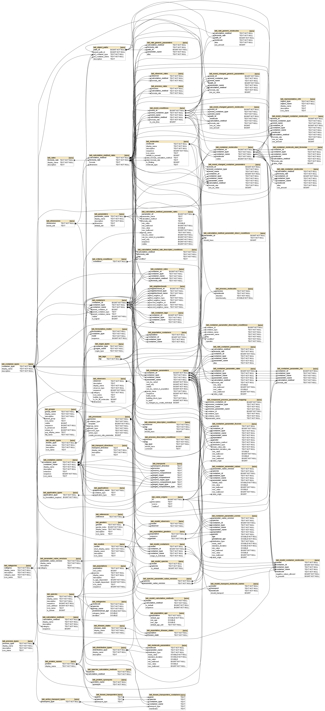

# Tables reference

- [tab_active_transport_types](#tab_active_transport_types)
- [tab_application_types](#tab_application_types)
- [tab_applications](#tab_applications)
- [tab_calculation_method_parameter_descr_conditions](#tab_calculation_method_parameter_descr_conditions)
- [tab_calculation_method_parameter_rates](#tab_calculation_method_parameter_rates)
- [tab_calculation_method_rate_descriptor_conditions](#tab_calculation_method_rate_descriptor_conditions)
- [tab_calculation_method_rates](#tab_calculation_method_rates)
- [tab_calculation_methods](#tab_calculation_methods)
- [tab_categories](#tab_categories)
- [tab_compound_process_parameter_mapping](#tab_compound_process_parameter_mapping)
- [tab_container_molecule_start_formulas](#tab_container_molecule_start_formulas)
- [tab_container_molecules](#tab_container_molecules)
- [tab_container_names](#tab_container_names)
- [tab_container_parameter_curves](#tab_container_parameter_curves)
- [tab_container_parameter_descriptor_conditions](#tab_container_parameter_descriptor_conditions)
- [tab_container_parameter_fcurves](#tab_container_parameter_fcurves)
- [tab_container_parameter_rates](#tab_container_parameter_rates)
- [tab_container_parameter_rhs](#tab_container_parameter_rhs)
- [tab_container_parameter_values](#tab_container_parameter_values)
- [tab_container_parameters](#tab_container_parameters)
- [tab_container_rates](#tab_container_rates)
- [tab_container_tags](#tab_container_tags)
- [tab_container_types](#tab_container_types)
- [tab_containers](#tab_containers)
- [tab_criteria_conditions](#tab_criteria_conditions)
- [tab_dimensions](#tab_dimensions)
- [tab_disease_states](#tab_disease_states)
- [tab_distribution_types](#tab_distribution_types)
- [tab_event_changed_container_molecules](#tab_event_changed_container_molecules)
- [tab_event_changed_container_parameters](#tab_event_changed_container_parameters)
- [tab_event_changed_generic_molecules](#tab_event_changed_generic_molecules)
- [tab_event_changed_generic_parameters](#tab_event_changed_generic_parameters)
- [tab_event_conditions](#tab_event_conditions)
- [tab_formulation_routes](#tab_formulation_routes)
- [tab_genders](#tab_genders)
- [tab_groups](#tab_groups)
- [tab_kinetic_types](#tab_kinetic_types)
- [tab_known_transporters](#tab_known_transporters)
- [tab_known_transporters_containers](#tab_known_transporters_containers)
- [tab_model_calculation_methods](#tab_model_calculation_methods)
- [tab_model_container_molecules](#tab_model_container_molecules)
- [tab_model_containers](#tab_model_containers)
- [tab_model_observers](#tab_model_observers)
- [tab_model_species](#tab_model_species)
- [tab_model_transport_molecule_names](#tab_model_transport_molecule_names)
- [tab_models](#tab_models)
- [tab_molecule_parameters](#tab_molecule_parameters)
- [tab_molecules](#tab_molecules)
- [tab_neighborhoods](#tab_neighborhoods)
- [tab_object_paths](#tab_object_paths)
- [tab_observer_descriptor_conditions](#tab_observer_descriptor_conditions)
- [tab_observer_rates](#tab_observer_rates)
- [tab_observers](#tab_observers)
- [tab_ontogenies](#tab_ontogenies)
- [tab_organ_types](#tab_organ_types)
- [tab_parameter_value_versions](#tab_parameter_value_versions)
- [tab_parameters](#tab_parameters)
- [tab_population_age](#tab_population_age)
- [tab_population_containers](#tab_population_containers)
- [tab_population_disease_states](#tab_population_disease_states)
- [tab_population_genders](#tab_population_genders)
- [tab_populations](#tab_populations)
- [tab_process_descriptor_conditions](#tab_process_descriptor_conditions)
- [tab_process_molecules](#tab_process_molecules)
- [tab_process_rates](#tab_process_rates)
- [tab_process_types](#tab_process_types)
- [tab_processes](#tab_processes)
- [tab_protein_names](#tab_protein_names)
- [tab_protein_synonyms](#tab_protein_synonyms)
- [tab_rate_container_molecules](#tab_rate_container_molecules)
- [tab_rate_container_parameters](#tab_rate_container_parameters)
- [tab_rate_generic_molecules](#tab_rate_generic_molecules)
- [tab_rate_generic_parameters](#tab_rate_generic_parameters)
- [tab_rates](#tab_rates)
- [tab_references](#tab_references)
- [tab_representation_info](#tab_representation_info)
- [tab_species](#tab_species)
- [tab_species_calculation_methods](#tab_species_calculation_methods)
- [tab_species_parameter_value_versions](#tab_species_parameter_value_versions)
- [tab_tags](#tab_tags)
- [tab_transport_directions](#tab_transport_directions)
- [tab_transports](#tab_transports)
- [tab_value_origins](#tab_value_origins)
