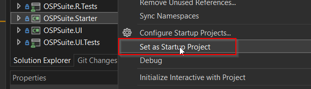

# Debugging

# Debugging in OSPSuite.Core

In order to be able to test some of the functionalities of the OSPSuite that reside in [OSPSuite.Core](https://github.com/Open-Systems-Pharmacology/OSPSuite.Core) there has been created in Core the OSPSuite.Starter project. You simply have to set it up as a startup project:



Then you can start with the debugger in Visual Studio:


As you can see in the window that appears you can test various Core functionalities both as a user and through breakpoints in code.


## Debugging between solutions

Apart from normally debugging through visual studio, sometimes there is the need to debug code that exists in OSPSuite.Core when running PKSim or MoBi. In order to do that you need to build OSPSuite.Core in the debug configuration. Then go to the solution folder and run "copy_to_pksim" or "copy_to_mobi" batch according to which solution you want to debug from core. 
You need to have the corresponding solution folder under the same parent directory, let's call it ROOT. So your OSPSuite.Core path would look lie this "..\ROOT\OSPSuite.Core". 
Then go to "ROOT\PK-Sim\src\PKSim\bin\Debug\net472" and start the PKSim.exe. When the application has started attach the debugger from Core to the process.

For MoBi you have to go to "ROOT\MoBi\src\MoBi\bin\Debug\net472", start "MoBi.exe" and accordingly attach the debugger from Core to the MoBi process. 

# Debugging from R script

You can also debug the OSPSuite.Core code from an R script. To do that you need to

1)  Build Core in the "Debug" configuration.

2) Copy the created dlls and associated .pdb files from "OSPSuite.Core\src\OSPSuite.R\bin\Debug\netstandard2.0\" to the your OSPSuite.R installation directory and specifically in the "OSPSuite-R\inst\lib\" folder.

3) Start the OSPSuite.R project in R 


4) Attach the Visual Studio debugger from the OSPSuite.Core solution to the RSession. Make sure to attach to rsession NOT to rstudio.exe.


5) Load using devtools and load_all to make sure the symbol files also get loaded:

```
devtools::load_all(".")
```
Now you can continue debugging. Note that if you have set a breakpoint in the part of the OSPSuite.Core code that gets called during the loading of OSPSuite.R, the debugger will already stop on it when you call `load_all(".")`. 
