# OSPSuite Architecture

## Introduction

In this part we will describe the Open Systems Pharmacology Suite, a set of powerful and easy-to-use modeling & simulation tools for pharmaceutical and other life-sciences applications. Qualified and accepted by the scientific community including academia, regulatory agencies and industry. This includes the main parts of the Suite and their architecture. Namely we have the following main components:

 * [OSPSuite Core](https://github.com/Open-Systems-Pharmacology/OSPSuite.Core) where the main functionalities of the Suite reside that are common in all other applications. 
 
 * [PK-Sim](https://github.com/Open-Systems-Pharmacology/PK-Sim),  a comprehensive software tool for whole-body physiologically based pharmacokinetic modeling  
 
 * [MoBi](https://github.com/Open-Systems-Pharmacology/MoBi), a software tool for multiscale physiological modeling and simulation that offers  more freedom for the user to import and set up models from scratch. 
 
 Additionally, [OSPSuite-R](https://github.com/Open-Systems-Pharmacology/OSPSuite-R) is a package that  provides the functionality of loading, manipulating, and simulating the simulations created in the Open Systems Pharmacology Software tools PK-Sim and MoBi in the R programming language. There are additional parts to the OSPSuite universe, f.e. [OSPSuite.SimModel](https://github.com/Open-Systems-Pharmacology/OSPSuite.SimModel) that reads the model description in its XML format, creates a differential equations system from it and solves it. 

The structure of the OSPSuite Architecture can be visualised as follows:

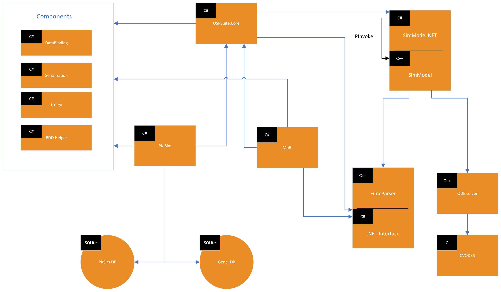

## Technology used

The Core of the OSPSuite as well as PKSim and MoBi are written using the .NET Framework currently in version 4.8. The language used is C# 7.3.
The architecture is based on the “onion architecture” and the view pattern used is the MVP pattern (Model-View-Presenter, Model-View-ViewModel etc.)
The underlying view engine is using Winforms. 

Severals third party components are being used in the application:
-	DevExpress .Net WinForm Suite. The DevExpress components are used in all views, even for the simplest UI elements such as button or label in order to support skins.
-	NHibernate. The ORM is used to serialize the pksim project into a SQLite database.
-	Castle. Excellent inversion of control container implementation.
-	NUnit. Simple yet powerful unit test framework.
- Npoi. Used to read from and write to xml files. 
-	FakeItEasy. Used in conjunction with NUnit to mock objects used in tests.
-	Microsoft Extensions Logging. Used to log any warnings or error to a log file or to the console when debugging.

## Architecture

The architecture used in PKSim IS NOT based on the traditional layered infrastructure. The traditional layer creates per construction a tight coupling between layers, as each layers depends on the layer beneath it and in general all layers depends on some cross-layer concerns such as security, logging etc usually defined in some kind of “infrastructure” layer. 
 
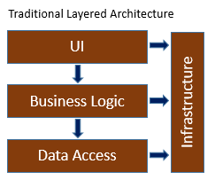

Instead, an infrastructure pattern was used called “Onion architecture”, that at the time of design of the OSPSuite was quite new and has been gaining popularity ever since.

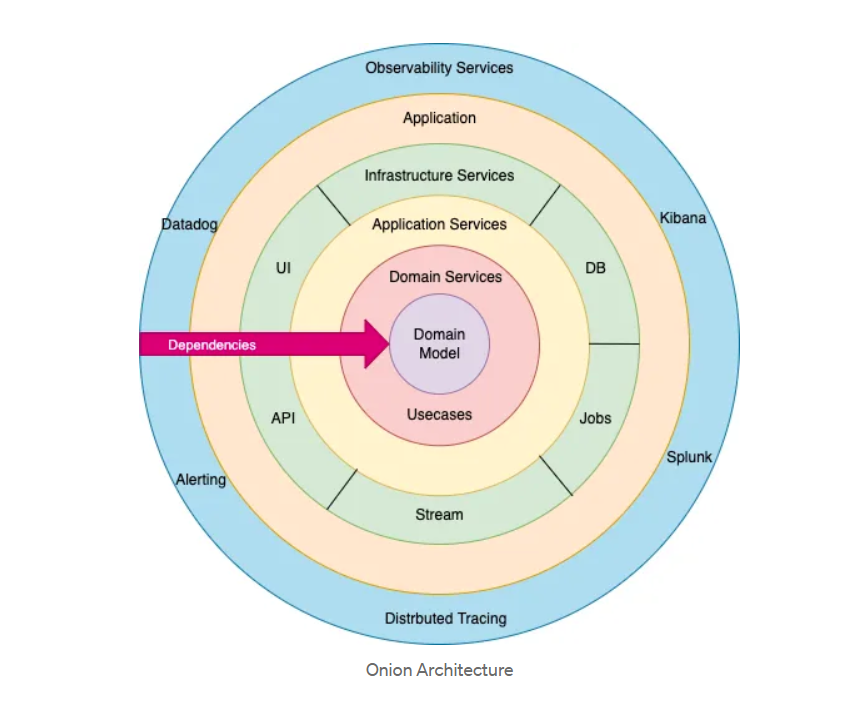
 
The idea behind this pattern is fairly simple: In a nutshell, ALL CODE CAN DEPEND ON LAYERS MORE CENTRAL, BUT CODE CANNOT DEPEND ON LAYER FURTHER OUT. The coupling is directed to the center of the architecture.
The domain model is always the center of the architecture and thus has no dependencies whatsoever on other layers. In the layer Domain Services, we would typically find interfaces providing serialization behavior. The implementation however would be on the outside of the architecture (Infrastructure) as the serialization involved databases or xml manipulations that have no place in the core.
 
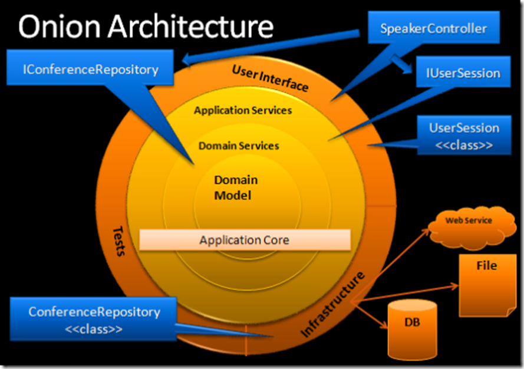

In this example, the `IConferenceRepository` interface is defined as a DomainServices that can thus be accessed from all presenters of the application. The implementation however resides in Infrastructure.

This architecture relies HEAVILY on the use of the [Dependency Inversion Principle](http://en.wikipedia.org/wiki/Dependency_inversion_principle).

The application core needs implementation of core interfaces, and if those implementing classes reside at the edges of the application, we need some mechanism for injecting that code at runtime so the application can do something useful.

In OSPSuite, we did not have the need to separate Application Services from Domain Services. We just use services. But the concept remains the same.

You can refer to the description of the onion architecture from the time of the original design of OSPSuite [part1](https://jeffreypalermo.com/2008/07/the-onion-architecture-part-1/) , [part2](http://jeffreypalermo.com/blog/the-onion-architecture-part-2/) , [part3](http://jeffreypalermo.com/blog/the-onion-architecture-part-3/) and [part4](https://jeffreypalermo.com/2013/08/onion-architecture-part-4-after-four-years/) for more information on this design patterns. Since the adoption of the onion architecture from OSPSuite, it has become ever more popular. You can also refer to the 2022 article about the onion architecture [here](https://medium.com/expedia-group-tech/onion-architecture-deed8a554423).

## OSPSuite.Core Project Structure

As discussed above the OSPSuite is mainly divided between three solutions. We will begin with  [OSPSuite Core](https://github.com/Open-Systems-Pharmacology/OSPSuite.Core) that contains all the common functionalities. The OSPSuite.Core solution has been separated in several projects reflecting the different concerns of the application:

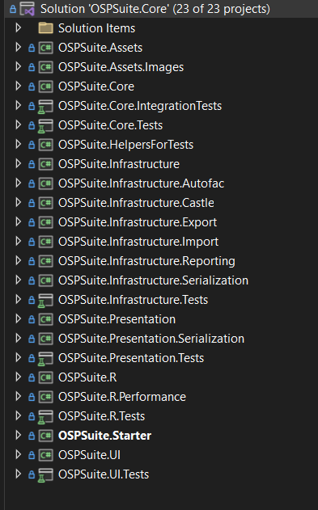

### OSPSuite.Assets

All strings displayed in the UI (captions, menus, tooltips, errors, warning, messages) and are common to both PK-Sim and MoBi. They are stored in one file call UIConstants. Although not implemented yet, this structure would enable the application to be used in different languages. It is required however to always define new strings in this file, and NEVER in the designer.

### OSPSuite.Assets.Images

In this project we define all the icons and images that are common to both PK-Sim and MoBi.This component has no other dependencies. It provides two static classes, ApplicationIcons and ApplicationImages that can be accessed throughout the presenter or UI layer to display icons and images.

### OSPSuite.Core

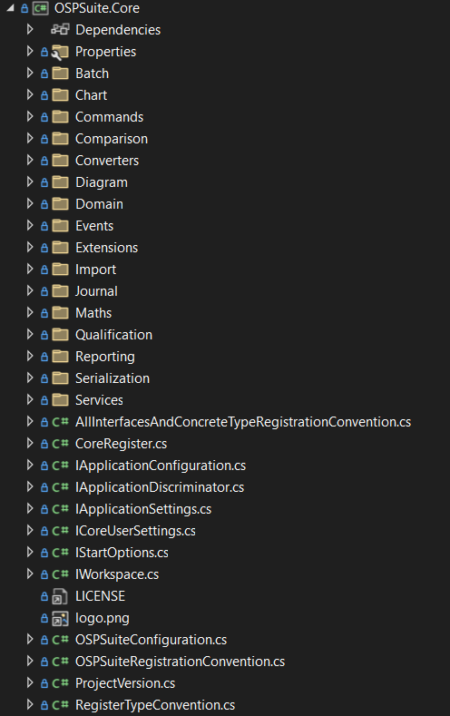

This is the central component of the infrastructure. It contains various namespaces:

* The namespace Commands contains all the commands that can be executed in OSPSuite and are common to both PK-Sim and MoBi. The command can be added in the history 
* The namespace Events contains the application wide events that will be thrown using the EventPublisher. 
* The namespace Extensions contains extension method that are not defined for specific ospsuite objects(methods on strings or object etc..)
* The namespace Mappers contains mapping object converting one core object into another core one.
* The namespace Import contains functionalities necessary for the importing of Excel and .csv files.
* The namespace Model contains the business objects of the application such as Simulation,Compound , Individual etc.
* The namespace Reporting contains the report items objects used to generate on the fly reports and tool tips for mode objects
* The namespace Services contains the services and tasks defined in the application and acting on the domain objects. All services interfaces are defined in this namespace. Implementation however can be found in another project. (see onion architecture). For instance, the ILazyLoadTask is defined in Services. The implementation LazyLoadTask is found in the infrastructure.

Objects defined in OSPSuite.Core are registered in the IoC container using a special PKSimRegistrationConvention convention: The code is well commented and should be studied for more information.

### OSPSuite.Infrastructure and OSPSuite.Infrastructure.* projects

This layers contains all serialization code, from database initialization, Export and Import of Excel files, to ORM Mapping with NHibernate. It is divided in multiple projects named accordingly. The serializers for commands and model objects are also defined in this assembly as well as the project converter specifics. You can find more detailed documentation of the Serialization and its uses [here](../NET-specifics/serialization.md) and also for the Commands [here](../NET-specifics/commands.md).

### OSPSuite.Presentation

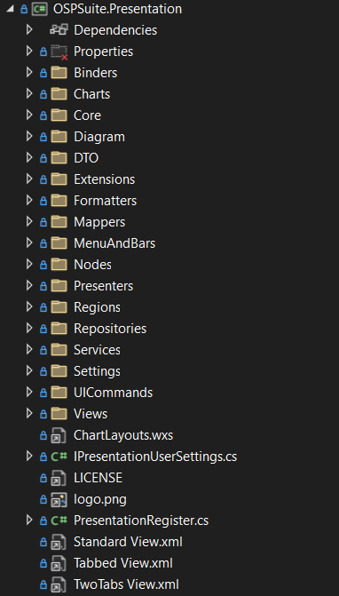

This is our presentation layer. It contains of course our presenters, but also the UICommands, DTOs and DTOMappers Charts Diagrams, View interfaces and more.

### OSPSuite.R

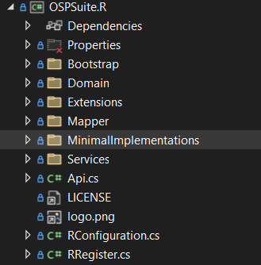

Here we have all our functionalities for the interfacing with R programming language, through OSPSuite.R. As part of the necessary preparation of this communication, it contains some side-effect-free classes and also minimal implementations of interfaces necessary for the software to run, that are never going to be called in the R context, as well as their registrations. The minimal implementations are all contained in the MinimalImplementations folder. An obvious example for this is the  `OSPSuite.R.MinimalImplementations.DialogCreator` minimal implementation of `IDialogCreator`.

### OSPSuite.Starter

This is a test project that you can set as a startup project and run as a desktop application. It should be used to user test functionalities that exist in OSPSuite.Core, without needing to open one of the solutions.

### OSPSuite.UI

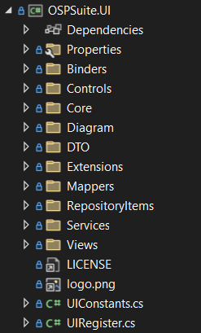

All Views and controls used in OSPSuite and common to both PK-Sim and MoBi are defined in this layer. No business logic whatsoever should be defined in this component. Any advance UI Logic should be moved to the presenter. Each view should be associated with a presenter, even the most basic view, as again, NO LOGIC SHOULD BE DEFINED IN THE VIEW. 

### Unit tests in OSPSuite

Unit testing is an integral part of our software practices and we keep the code that we write well covered by tests. All the solutions contain multiple tests, that are mainly divided into unit tests and integration tests. Apart from the brief description of the OSPSuite.Core unit test projects in the following paragraphs, you can find a comprehensive documentation of our unit testing methods and best practices [here](../NET-specifics/unit-and-integration-testing.md).

### OSPSuite.InfrastructureTests

This project contains unit tests for the functionalities in all the Infrastructure projects. The tests in this project implement the `OSPSuite.BDDHelper.ContextSpecification<T>`.

### OSPSuite.PresentationTests

This project contains unit tests for the functionalities in the infrastructure layer. The tests in this project implement the `OSPSuite.BDDHelper.ContextSpecification<T>`.

### OSPSuite.UITests

This project contains unit tests for the functionalities in the UI layer. The tests in this project also implement the `OSPSuite.BDDHelper.ContextSpecification<T>`

### OSPSuite.IntegrationTests

This project contains all the integration tests ever written for OSPSuite. The folder Data contains some external files (mainly excel and pkml files) that are used in the Integration tests.

In the tests of this project we are extending `OSPSuite.Core.ContextForIntegration<T>`. It registers almost all dependencies as the real OSPSuite applications would do, with the exception of a few objects like license or dialog creator. It is the perfect base class to use when testing real uses cases using the database etc… Execution time is much longer than a standard unit test.

## PKSim Project Structure

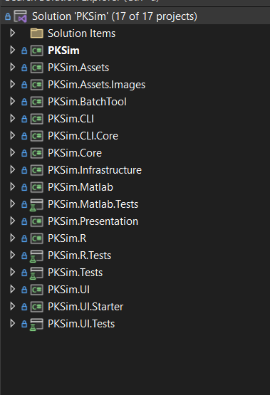

In this solution we have the code that is exclusive for the PK-Sim application.

### PKSim.Assets and PKSim.Assets.Images

Just like the equivalent projects in OSPSuite.Core, these two projects contain the UI strings, images and icons that are used exclusively for the PK-Sim application. Any new string used in the UI should be defined here.

### PKSim.Core

Contains the main functionalities of the PK-Sim application.

### PKSim.Infrastructure

This layers contains all code on serialization, project conversion, ORM Mapping with NHibernate and reporting that is specific to PKSim and is not included in OSPSuite.Core.Infrastructure and the OSPSuite.Core.Infrastructure.* projects.

### PKSim.Presentation

It is the Presentation Layer specific for the PK-Sim application. Just like its equivalent in OSPSuite.Core, contains presenters, but also View Interfaces, DTOs and DTO mappers, UICommands and more. It has to be stressed that here should only be present the aforementioned elements that are unique to PK-Sim - elements of that type that are also common for MoBi should be added in OSPSuite.Core.Presentation.

### PKSim.UI

Contains all Views and Controls specific only to the PK-Sim application. UI elements shared with MoBi exist in OSPSuite.Core.UI.

### PKSim.CLI

In this project we have code that enables the PKSim to be used from the command line. This can be used f.e. for task automatizations using projects and snapshots as input. It is also being used by the [InstallationValidator](https://github.com/Open-Systems-Pharmacology/InstallationValidator).

### PKSim.CLI.Core

Contains code of the main functionalities of the CLI. Here we also have the minimal implementations of interfaces that are necessary for the OSPSuite code to run, but that we know that we are not going to be using in the command line scenario and thus they are not fully implemented. An obvious example for that would be the `CLIDialogCreator` minimal implementation of `IDialogCreator`.

### PKSim.BatchTool

Contains all the code related to the Batch Tool, that provides a graphic interface for the user to run PK-Sim tasks on json based PK-Sim simulations in batches. It can also be used to create a new project from snapshots and vice versa. It contains the necessary presenters, views and DTOs for this.  

### PKSim.R

This project contains the code necessary for the communication between PK-Sim and R through the [ospsuite-R package](https://github.com/Open-Systems-Pharmacology/OSPSuite-R).

### PKSim.Tests

This projects contains unit tests for various aspects of the PKSim sourcecode, such as Infrastructure, Presentation, PKSim.Core etc. The tests in this project implement the `OSPSuite.BDDHelper.ContextSpecification<T>`, except for the Integration Tests that implement `PKSim.IntegrationTests.ContextForIntegration<T>` which is written specifically for setting up an environment and registering all the dependencies necessary to run integration tests in PK-Sim. 

### PKSim.UI.Tests

Contains tests for the UI elements of PK-Sim. The tests in this project implement the `OSPSuite.BDDHelper.ContextSpecification<T>`.

### PKSim.Matlab

This dll should be used directly from Matlab to automate some PKSim tasks such as individual or population creation etc.

## MoBi Project Structure

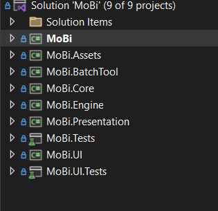

### MoBi project

Here we have the entry point of the MoBi application and some other things, like pkml Templates and Chart Layouts.

### MoBi.Assets

This project contains UI strings, images and icons that are used exclusively for the Mobi application. Any new string used in the UI should be defined here.

### MoBi.Core

Contains the main functionalities of the MoBi application, that are distinct from what is defined in OSPSuite.Core.

### MoBi.Engine

Contains the [SBML](https://sbml.org/) importer and engine for MoBi.

### MoBi.Presentation

It is the Presentation Layer specific for the MoBi application. Just like its equivalent in OSPSuite.Core, contains presenters, but also View Interfaces, DTOs and DTO mappers, UICommands and more. It has to be stressed that here should only be present the aforementioned elements that are unique to MoBi - elements of that type that are also common for MoBi should be added in OSPSuite.Core.Presentation.

### MoBi.UI

Contains all Views and Controls specific only to the MoBi application. UI elements shared with MoBi exist in OSPSuite.Core.UI.

### MoBi.Tests

This projects contains unit tests for various aspects of the MoBi sourcecode, such as Infrastructure, Presentation, PKSim.Core etc. The tests in this project implement the `OSPSuite.BDDHelper.ContextSpecification<T>`, except for the Integration Tests that implement PKSim.MoBi.IntegrationTests.ContextForIntegration<T> which is written specifically for setting up an environment and registering all the dependencies necessary to run integration tests in MoBi. Also contains helper functions for those tests, mainly for creating objects to be used in the tests, like f.e. a `DimensionFactory`.

### MoBi.UI.Tests

Contains tests for the UI elements of MoBi The tests in this project implement the `OSPSuite.BDDHelper.ContextSpecification<T>`.

## PK-Sim Database

PK-Sim uses an SQLite database to store species, population etc. You can find a thorough documentation of the database and its tables [here](../PKSim-DataBase/DB.md).

## Additional components and further reading

Additionally to these three main solutions, more components are being used in the OSPSuite as mentioned above.

You can read more about the [OSPSuite.SimModel](https://github.com/Open-Systems-Pharmacology/OSPSuite.SimModel) ( that as mentioned above reads the model description in its XML format, creates a differential equations system from it and solves it), and specifically about how to find memory leaks in it here:

[Finding Memory Leaks](../sim-model/finding-memory-leaks.md)

You can read about the algorithm used for the creation of an individual in this part of the documentation:

[Algorithm for Individual Creation](../algorithms/algorithm-for-individual-creation.md)

The functionalities of OSPSuite can be used in the R programming language through the [OSPSuite-R package](https://www.open-systems-pharmacology.org/OSPSuite-R/). You can go through a comprehensive documentation of how to install and use the package [here](https://www.open-systems-pharmacology.org/OSPSuite-R/). You can also find a more detailed description of the code structure for the package as part of this documentation [here](../ospsuite-r-specifics/r-code-structure.md).For installing under various systems you can also refer to the current [documentation]:

[Setup OSPSuite-R on Windows Or Ubuntu](../ospsuite-r-specifics/setup-ospsuite-r-on-windows-or-ubuntu.md)

Concerning the data binding, there are two separate OSPSuite solutions that contain functionality that enables us to bind data to UI elements. You can read all about that [here](../NET-specifics/data-binding.md). 

