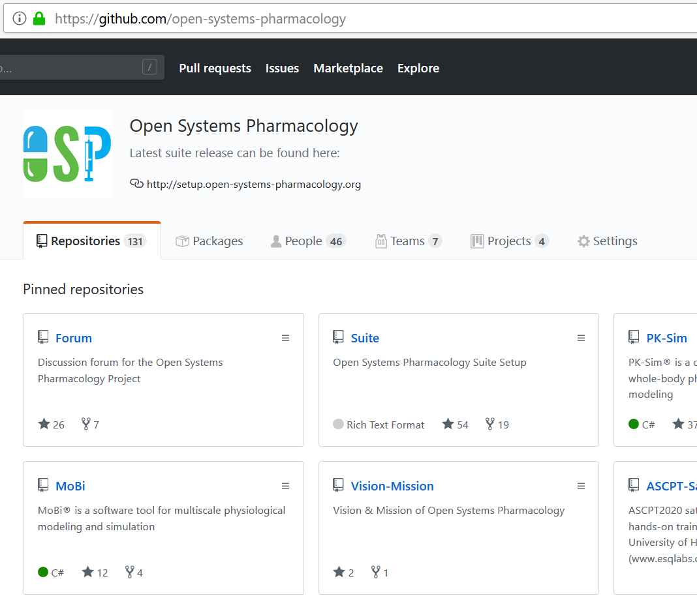
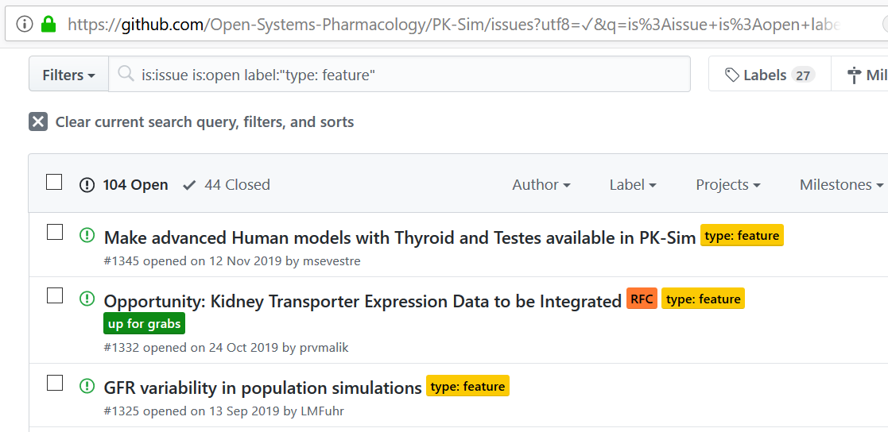
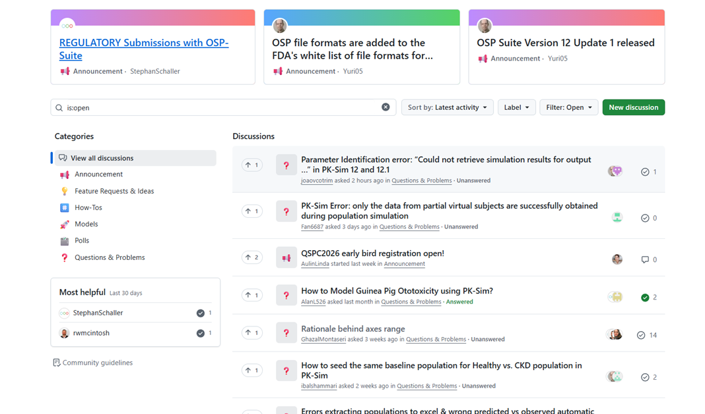
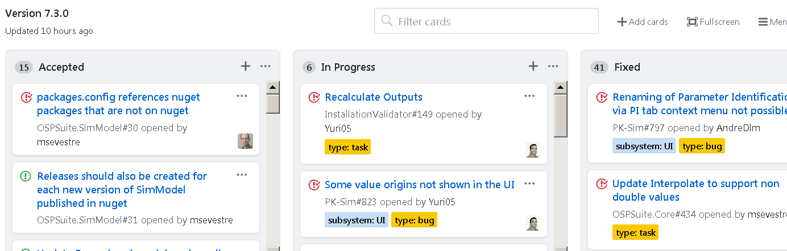
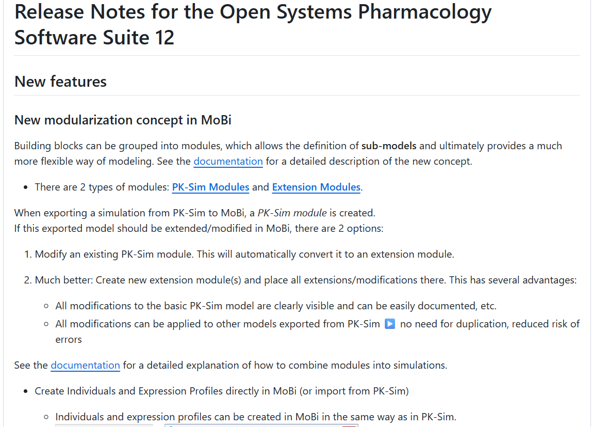

# Software Engineering

The Open Systems Pharmacology Suite (OSP Suite) is the open-source platform. The OSP Suite is the result of over 20 years of effort from experts in software development, database management, mathematics, biology, physiology, pharmacokinetics, pharmacology, and systems biology. This multi-million dollar platform was made open-source in early 2017 to accelerate the development and application of PBPK models and systems modeling in the drug development process.

## Source Control
The OSP Suite uses GitHub as a source control platform.

GitHub is a web-based hosting service for version control using Git. It offers all of the distributed version control and source code management (SCM) functionality of Git as well as adding its own features. It provides access control and several collaboration features such as bug tracking, feature requests, task management, and wikis for every project.

GitHub offers plans for both private repositories and free accounts, which are commonly used to host open-source software projects. All Repositories in the scope of the OSP Suite are public. As of January 2023, GitHub reports having over 100 million users and more than 420 million repositories (including at least 28 million public repositories), making it the largest host of source code in the world.

In addition to source code, GitHub supports the following formats and features:
* Documentation, including automatically rendered README files in a variety of Markdown-like file formats
* Issue tracking (including feature requests) with labels, milestones, assignees and a search engine
* Wikis
* [GitHub Codespaces](https://en.wikipedia.org/wiki/GitHub_Codespaces), an online Integrated Development Environment (IDE) providing users with a virtual machine intended to be a work environment to build and test code
* [Discussions](https://docs.github.com/en/discussions)
* Security Alerts of known [common vulnerabilities and exposures](https://en.wikipedia.org/wiki/Common_Vulnerabilities_and_Exposures) in different packages
* Pull requests with code review and comments
* Commits history
* Graphs: pulse, contributors, commits, code frequency, punch card, network, members
* Email notifications and the option to subscribe someone to notifications by @ mentioning them
* GitHub Pages: small websites can be hosted from public repositories on GitHub. This is what we have done for the OSP Suite where the site https://www.open-systems-pharmacology.org/ is a user friendly gateway to the OSP Platform
* PDF document viewer

## Issue Tracking
The OSP Suite uses GitHub as an issue tracker. Every user with a valid GitHub account can submit an issue and participate in discussions. Issues are related to bugs and features. They have a life cycle and different issues can be linked to each other. GitHub supports collaboration over issues such that members can comment and discuss publicly.

## Forum
The Forum is used e.g. for scientific discussions related to the OSP platform and is realized as a [Discussion tab](https://docs.github.com/en/discussions) in a dedicated Forum repository. https://github.com/Open-Systems-Pharmacology/Forum/discussions

## Release Planning
Release planning is realized via the GitHub “Projects” feature. Issues are organized by milestones and effort estimates are proposed and tracked. Release planning is done by the OSP Management Team.

Approved “official” releases of the OSP Suite are published on the GitHub Platform and can be downloaded by any user (no GitHub account is required for this). Full release histories are available on GitHub and include any changes made in the release from the previous version and any Release Notes.

## Continuous Integration
Continuous Integration (CI) is a software development practice that aims at preventing code integration problems and improving overall software quality. It requires developers to update their code (commit) into a code repository. Periodically or even after each commit, the code is verified by an automated build running on the Continuous Integration Server (CI Server). Upon build completion, teams are notified of any defects or issues that were found thus allowing developers to detect and fix problems early. The Continuous Integration Process (CI Process) describes the tasks to be performed by the automated build.

Continuous integration of the OSP Suite is realized through [GitHub Actions](https://github.com/features/actions). GitHub Actions is a hosted, distributed continuous integration service used to build and test projects hosted on GitHub for Windows, Linux, and macOS. It provides the following features:

* Test automation
  * Run unit tests on each commit of the source code
  * Run integration/module/systems tests periodically (e.g. nightly) because slower tests are run less frequently
  * Logging mechanism and test reports
  * Notify team when build or unit tests are failing
* Build automation
  * Setups of different OSP Platform tools as well as of the whole Suite are created nightly
* Code quality analysis (e.g. static code analysis, test coverage)
* Artifact repository (setup, reports): Nightly builds that incorporate any new features/fixes can be accessed by anyone for beta testing. Full testing and code coverage reports can be accessed and investigated by all for each build.
* Semantic code analysis with [Dependabot](https://docs.github.com/en/code-security/getting-started/dependabot-quickstart-guide) and [CodeQL](https://codeql.github.com/docs/codeql-overview/about-codeql/) scanning for security vulnerabilities
  * Dependabot scans repository for known vulnerable dependencies
  * CodeQL scans the source code for known vulnerabilities
  * Both scanners alert developers to newly created, or newly added vulnerabilities and can create issues to be addressed or are reported in the security tab of the repository

## Validation
Validation of computerized system: Comprehensive library of test cases that grows with every newly released feature, including manual or automatic with validated programs.

1. Testing correct behavior of software modules. Tests triggered with every software build [(Unit Tests, Integration Tests …)](#continuous-integration).
2. Comparison of simulation outputs to verified standards for specific combinations of compounds, organisms, calculation methods, and model options.
3. Automated tests in different software environments (different operating systems etc.)
4. Test of new features by the scientific experts (e.g. via creation of various simulation scenarios and comparing of simulated results with published study data)

## General Qualification of the PBPK Platform
* Qualification of the model structure

  * Qualified by design

      * Based on biological structure (physiologically based) and relevant biological processes ( absorption, distribution, metabolism, excretion)
      * Only slight structural changes between species (human, monkey, dog, rat, mouse, beagle, rabbit, minipig)

  * Qualification of physiological parameters

      * Some of them qualified by design, e.g. input from studies (weight, height, …)
      * Others qualified by prior information: Literature values, different project experience, learning...

  * Qualification of proteins, enzyme, transporter parameters

      * From experiments, taken as a priori information
      * Inferred parameters from estimation based on data

## Qualification for intended use
The "qualification for intended use” introduced in the European Medicines Agency guideline translates into the following two major challenges:

1. The provision of a sufficient package of successful prediction case studies
1. Full transparency of the approach, processes, tools and models used

Automated qualification support is a built-in functionality of the OSP Suite.

A qualification repository consists of:

1. (references to) model project files and experimental data
1. formal qualification plan describing the simulations, visualizations, and reporting to be automatically generated by a qualification engine.
Several qualification repositories for drug–drug interactions and pediatric applications have already been published on GitHub.

Details are given in:

* https://docs.open-systems-pharmacology.org/shared-tools-and-example-workflows/qualification
* http://onlinelibrary.wiley.com/doi/10.1002/psp4.12473