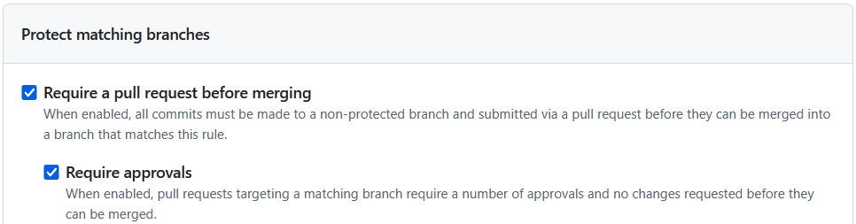
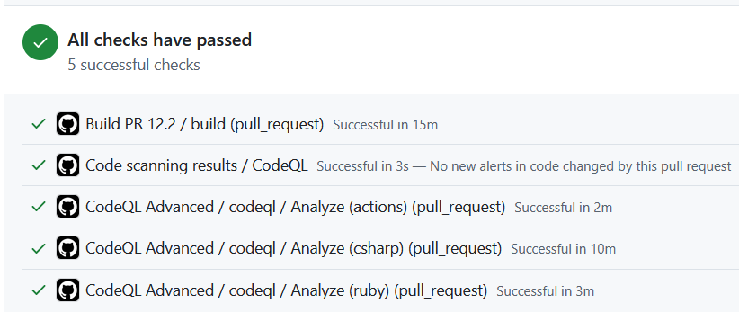
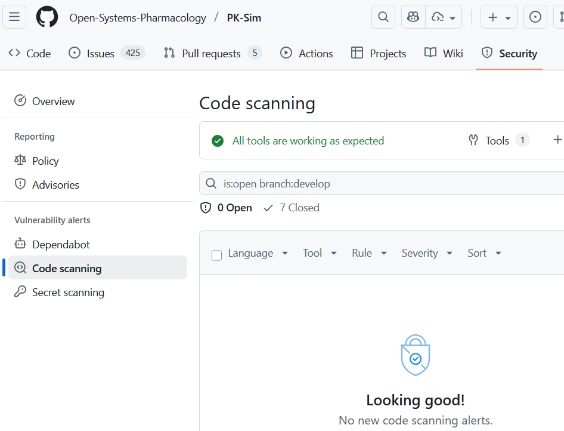

# Transparency and security

## Source Code Modifications
The whole source code of the OSP Suite is stored and versioned on GitHub.

As of January 2023, GitHub reports having over 100 million users and more than 420 million repositories (including at least 28 million public repositories), making it the largest host of source code in the world.

Among others, GitHub is used by companies like Google or Microsoft for the code hosting, for example [Google](https://github.com/google) and [Microsoft](https://github.com/microsoft)

Source code on the OSP can be modified by the OSP Maintainers only. OSP Maintainers consist of a very limited number of people (and is a subset of OSP Management Team (MT), OSP Sounding Board (SB) and OSP Core Developers (DEV)).

When source code modifications must be done, the procedure is as follows:

* Any user can propose changes for the software by creating a so called [Pull Request (PR)](https://en.wikipedia.org/wiki/Distributed_version_control#Pull_requests)

* Those changes are not automatically accepted into the software

* Instead members of the SB and DEV team review this proposal and decide if proposed changes could be integrated

* In case of positive decision: revalidation of the software with integrated proposed changes is performed

* If the outcome of the revalidation is positive: proposed changes are accepted as part of the official release

This is a well-established procedure used particularly by GitHub for open source and closed source (commercial) software, used by millions of customers.

## Build Process
Building of the OSP Libraries and Setups is realized in a fully automated manner via GitHub Actions CI service [(s. section Software Engineering/Continuous Integration)](software-engineering.md#continuous-integration).<!-- this link works but the link checker identifies it as not working -->

When building a library or a setup: the corresponding source code from the OSP is transferred into such a build environment and a build process is triggered; resulting build artifacts (libraries/setups) are stored in the GitHub cloud.

This process is fully automated. Particularly:
* Nobody (except core developers (DEV)) can change a standard build environment.
* Nobody can modify source code during build
* Nobody can modify produced build artifacts.

## Transparency

### Source Code

* All source code is public.

* All code changes are tracked and saved in the history, including:

  * Full list of changes
  * Date and time stamp
  * Names of the contributors
  * Names of the Reviewers
  * Name of the person who has integrated the changes (accepted the corresponding PR)
  * Links to associated validation reports
  

Example: [https://github.com/Open-Systems-Pharmacology/Suite/commits/master](https://github.com/Open-Systems-Pharmacology/Suite/commits/master)

* Code changes history entries cannot be modified

### Software Builds

* All software builds are tracked and saved in the build history, including:
  * Link to the used version of the source code on GitHub
  * Date and time stamp
  * Full build log
  * Test protocols of all automated tests
  * All produced build artifacts
  

Example: [https://github.com/Open-Systems-Pharmacology/Suite/actions/workflows/build-and-publish.yml](https://github.com/Open-Systems-Pharmacology/Suite/actions/workflows/build-and-publish.yml)

* Build history entries cannot be modified

### Software validation and qualification
An overview of validation steps and links to validation/test reports are published with every OSP Suite release on GitHub ([https://github.com/Open-Systems-Pharmacology/Suite/tree/master/validation%20and%20qualification](https://github.com/Open-Systems-Pharmacology/Suite/tree/master/validation%20and%20qualification)) E.g., the test reports of the OSP Suite version 8 contain more than 10,000 tests.

Qualification reports of the OSP platform are published on GitHub. Examples:

* [https://github.com/Open-Systems-Pharmacology/Pediatric_Qualification_Package_GFR_Ontogeny/releases](https://github.com/Open-Systems-Pharmacology/Pediatric_Qualification_Package_GFR_Ontogeny/releases)
* [https://github.com/Open-Systems-Pharmacology/Pediatric_Qualification_Package_CYP3A4_Ontogeny/releases](https://github.com/Open-Systems-Pharmacology/Pediatric_Qualification_Package_CYP3A4_Ontogeny/releases)
* [https://github.com/Open-Systems-Pharmacology/Pediatric_Qualification_Package_CYP2C8_Ontogeny/releases](https://github.com/Open-Systems-Pharmacology/Pediatric_Qualification_Package_CYP2C8_Ontogeny/releases)

## Security 

### Branch protection
The **default** branch and the **main** branch (if different from the default) in the code repositories are protected using GitHub's [branch protection rules](https://docs.github.com/en/repositories/configuring-branches-and-merges-in-your-repository/managing-protected-branches/managing-a-branch-protection-rule).

* This prevents any user (including repository maintainers and organization administrators) from directly pushing code into a protected branch without first creating a pull request.
* Every pull request can only be merged after being approved by the repository maintainer(s).
  
   

### Static Application Security Testing (SAST)

SAST is fully integrated into the OSP CI Pipeline via GitHub's [CodeQL](https://docs.github.com/en/code-security/code-scanning/introduction-to-code-scanning/about-code-scanning-with-codeql), which is part of _GitHub Advanced Security_ (GHAS).
* Source code is scanned for vulnerabilities with every modification and before a pull request is merged into the code base.
  
   
  
* Additionally, the existing code base is scanned weekly.
  
  * All found security alerts appear directly in the **Security** tab of a repository and can be quickly addressed by the development team.
  
     

### Software Composition Analysis (SCA)

The OSP codebase is protected by continuous Software Composition Analysis (SCA) using [GitHub Dependabot](https://docs.github.com/code-security/dependabot). Dependabot monitors open-source dependencies against the _GitHub Advisory Database_ and _Common Vulnerabilities and Exposures (CVE)_ database.

When a vulnerability is identified, Dependabot automatically notifies the developers and creates pull requests with safe, patched versions. The OSP developer team then reviews and merges these updates promptly.

 

### Release security: VirusTotal scanning and badges

To help you use the OSP Suite and its standalone tools (PK-Sim and MoBi) with confidence, every release is scanned for viruses and other threats before publication. All installer and archive formats (EXE, MSI and ZIP) are submitted to [VirusTotal](https://www.virustotal.com) for independent, multi-engine analysis. 
A badge is then added to each GitHub release that links directly to the corresponding VirusTotal scan results. 

Example:

* What is VirusTotal?
  * [VirusTotal](https://www.virustotal.com/) is a file and URL scanning service that aggregates results from 60+ antivirus engines and reputation services. It also uses static and dynamic (sandbox) analysis.
  * Reports typically include:
    * A detection summary (e.g. 'No security vendors flagged this file' or 'The number of engines that flagged it').
    * Per-vendor verdicts and details.
    * Behavioral and sandbox observations (where applicable).
    * File metadata, such as hashes (SHA-256), size and first/last seen times.

* How to interpret the results:
  * A clean result across all engines indicates that the file is likely to be safe. 
  * False positives can occur. Engine definitions evolve over time, so results may change as vendors update their signatures.
  * If you see any detections that concern you, review the per-engine details in VirusTotal and contact the OSP team with a link to the report.

* Notes and best practices:
  * Always download installers from the official OSP release pages.
  * The VirusTotal badge links to the scan performed at the time of release; you can also rescan on VirusTotal to see the latest vendor verdicts.